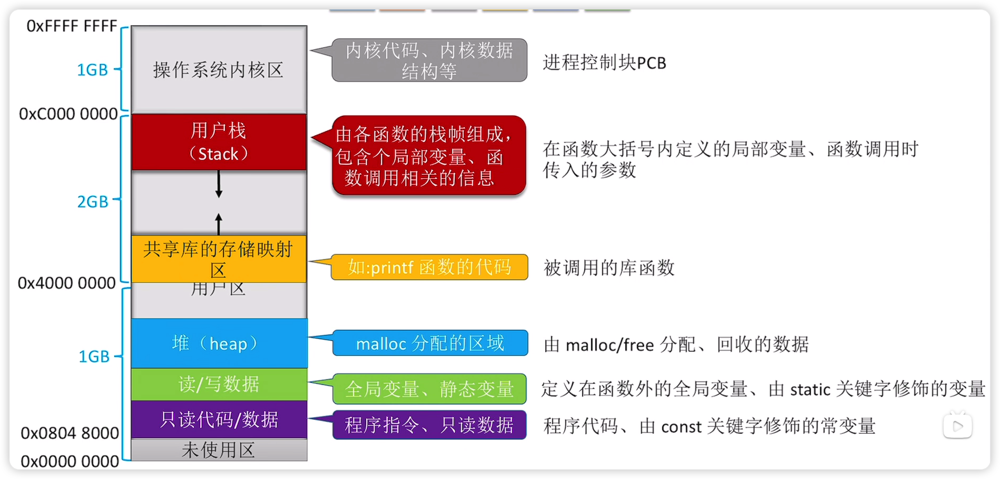
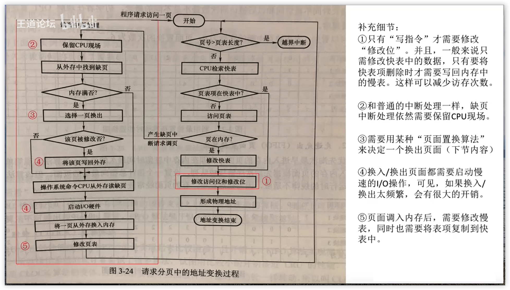
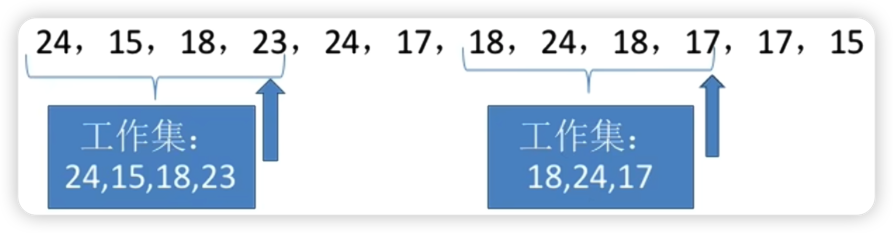

# 内存的基础知识

## 进程运行的基本原理

### 装入的三种方式

#### 绝对装入

在编译时，如果知道程序将放到内存中的哪个位置，编译程序将产生绝对地址的目标代码。装入程序按照装入模块中的地址，将程序和数据装入内存

#### 静态重定位

又称 **可重定位装入**。编译、链接后的装入模块的地址都是从0开始的，指令中使用的地址、数据存放的地址都是相对于起始地址而言的逻辑地址。可根据内存的当前情况，将装入模块装入到内存的适当位置。装入时对地址进行 **重定位**，将逻辑地址变换为物理地址（地址变换是在装入时一次完成的）

静态重定位的特点是在一个作业装入内存时，**必须分配其要求的全部内存空间**，如果没有足够的内存，就不能装入该作业。作业一旦进入内存后，**在运行期间就不能再移动**，也不能再申请内存空间

#### 动态重定位

又称 **动态运行时装入**。编译、链接后的装入模块的地址都是从0开始的。装入程序把装入模块装入内存后，并不会立即把逻辑地址转换为物理地址，而是 **把地址转换推迟到程序真正要执行时才进行**。因此装入内存后所有的地址依然是逻辑地址。这种方式需要一个 **重定位寄存器** 的支持

采用动态重定位时 **允许程序在内存中发生移动**

并且可将程序分配到不连续的存储区中；在程序运行前只需装入它的部分代码即可投入运行，然后在程序运行期间，根据需要动态申请分配内存；便于程序段的共享，可以向用户提供一个比存储空间大得多的地址空间

### 从写程序到程序运行

**编译**：由编译程序将用户源代码编译成若干个目标模块（编译就是把高级语言 **翻译为机器语言**）  
**链接**：由链接程序将编译后形成的一组目标模块，以及所需库函数链接在一起，形成一个完整的装入模块  
**装入（装载）**：由装入程序将装入模块装入内存运行

#### 链接的三种方式

##### 静态链接

在程序运行之前，先将各目标模块及它们所需的库函数连接成一个完整的可执行文件（装入模块），之后不可拆开

##### 装入时动态链接

将各目标模块装入内存时，边装入边链接的链接方式

##### 运行时动态链接

在程序执行中需要该目标模块时，才对它进行链接。其优点是便于修改和更新，便于实现对目标模块的共享

# 内存管理的概念

## 内存空间的分配与回收

### 连续分配管理方式

#### 单一连续分配

在单一连续分配方式中，内存被分为 **系统区** 和 **用户区**。系统区通常位于内存的低地址部分，用于存放操作系统相关数据；用户区用于存放用户进程相关数据  
内存中**只能有一道用户程序**，用户程序独占整个用户区空间

**优点**：实现简单；**无外部碎片**；可以采用覆盖技术扩充内存；不一定需要采取内存保护（eg：早期的PC操作系统 MS-DOS）

**缺点**：只能用于单用户、单任务的操作系统中；有内部碎片；存储器利用率极低

#### 固定分区分配

20世纪60年代出现了支持多道程序的系统，为了能在内存中装入多道程序，且这些程序之间又不会相互干扰，于是将整个 **用户空间** 划分为**若干个固定大小的分区**，**在每个分区中只装入一道作业**，这样就形成了最早的、最简单的一种可运行多道程序的内存管理方式

**分区大小相等**：缺乏灵活性，但是很 **适合用于用一台计算机控制多个相同对象的场合**（比如：钢铁厂有n个相同的炼钢炉，就可把内存分为n个大小相等的区域存放n个炼钢炉控制程序）

**分区大小不等**：增加了灵活性，可以满足不同大小的进程需求。根据常在系统中运行的作业大小情况进行划分（比如：划分多个小分区、适量中等分区、少量大分区）

操作系统需要建立一个数据结构一一**分区说明表**，来实现各个分区的分配与回收。每个表项对应一个分区，通常按分区大小排列。每个表项包括对应分区的 **大小、起始地址、状态**（是否己分配）

当某用户程序要装入内存时，由操作系统内核程序根据用户程序大小检索该表，从中找到一个能满足大小的、未分配的分区，将之分配给该程序，然后修改状态为“己分配”

**优点**：实现简单，无外部碎片。

**缺点**：

1. 当用户程序太大时，可能所有的分区都不能满足需求，此时不得不采用覆盖技术来解决，但这又会降低性能：
2. **会产生内部碎片**，内存利用率低

#### 动态分区分配

又称为 **可变分区分配**。这种分配方式 **不会预先划分内存分区**，而是在进程装入内存时，**根据进程的大小动态地建立分区**，并使分区的大小正好适合进程的需要。因此系统分区的大小和数目是可变的。（eg：假设某计算机内存大小为 64MB，系统区 8MB，用户区共56MB.）

**使用以下的数据结构记录内存的使用情况**

- 空闲分区表
- 空闲分区链

把一个新作业装入内存时，须按照一定的 **动态分区分配算法**，从空闲分区表（或空闲分区链）中选出一个分区分配给该作业。由于分配算法对系统性能有很大的影响，因此人们对它进行了广泛的研究

动态分区分配没有 **内部碎片**，但是有 **外部碎片**  
**内部碎片**：分配给某进程的内存区域中，如果有些部分没有用上  
**外部碎片**：是指内存中的某些空闲分区由于太小而难以利用

如果内存中空闲空间的总和本来可以满足某进程的要求，但由于进程需要的是一整块连续的内存空间，因此这些 *碎片*不能满足进程的需求  
可以通过 **紧凑（拼凑，Compaction）** 技术来解决外部碎片

### 动态分区分配算法

#### 首次适应算法

**算法思想**：每次都从低地址开始查找，找到第一个能满足大小的空闲分区

**如何实现**：**空闲分区以地址递增的次序排列**。每次分配内存时顺序查找 **空闲分区链**（或 **空闲分区表**），找到大小能满足要求的第一个空闲分区

#### 最佳适应算法

**算法思想**：由于动态分区分配是一种连续分配方式，为各进程分配的空间必须是连续的一整片区域。因此为了保证当“大进程”到来时能有连续的大片空间，可以尽可能多地留下大片的空闲区，即，优先使用更小的空闲区

**如何实现**：空闲分区 **按容量递增次序链接**。每次分配内存时顺序查找 **空闲分区链**（或 **空闲分区表**），找到大小能满足要求的第一个空闲分区

**缺点**：每次都选最小的分区进行分配，会留下越来越多的、很小的、难以利用的内存块。因此这种方法会产生很多的外部碎片

#### 最坏适应算法

又称 **最大适应算法（Largest Fit）**

**算法思想**：为了解决最佳适应算法的问题一一即留下太多难以利用的小碎片，可以在每次分配时优先使用最大的连续空闲区，这样分配后剩余的空闲区就不会太小，更方便使用

**如何实现**：空闲分区按容量递减次序链接。每次分配内存时顺序查找 **空闲分区链**（或 **空闲分区表**），找到大小能满足要求的第一个空闲分区

#### 临近适应算法

**算法思想**：首次适应算法每次都从链头开始查找的。这可能会导致低地址部分出现很多小的空闲分区，而每次分配查找时，都要经过这些分区，因此也增加了查找的开销。如果每次都从上次查找结束的位置开始检索，就能解决上述问题

**如何实现**：空闲分区以地址递增的顺序排列（可排成一个循环链表）。每次分配内存时 **从上次查找结束的位置开始** 查找 **空闲分区链**（或 **空闲分区表**），找到大小能满足要求的第一个空闲分区

## 内存空间的扩充

### 覆盖技术

**覆盖技术的思想**：将 **程序分为多个段**（多个模块）  
常用的段常驻内存，不常用的段在需要时调入内存

内存中分为 **一个“固定区”** 和 **若干个“覆盖区”**

需要常驻内存的段放在 **固定区** 中，**调入后就不再调出**（除非运行结束）  
不常用的段放在 **覆盖区**，**需要用到时调入内存，用不到时调出内存**

**必须由程序员声明覆盖结构**，操作系统完成自动覆盖

**缺点**：**对用户不透明**，增加了用户编程负担

覆盖技术只用于早期的操作系统中，现在己成为历史

### 交换技术

**交换（对换）技术的设计思想**：内存空间紧张时，系统将内存中某些进程暂时 **换出** 外存，把外存中某些己具备运行条件的进程 **换入** 内存（进程在内存与磁盘间动态调度）

具有对换功能的操作系统中，通常把磁盘空间分为 **文件区** 和 **对换区** 两部分。**文件区** 主要用于存放文件，**主要追求存储空间的利用率**，因此对文件区空间的管理 **采用离散分配方式**；**对换区** 空间只占磁盘空间的小部分，**被换出的进程数据就存放在对换区**。由于对换的速度直接影响到系统的整体速度，**因此对换区空间的管理主要追求换入换出速度**，因此通常对换区 **采用连续分配方式**（学过文件管理章节后即可理解）。总之，**对换区的I/O速度比文件区的更快**

交换通常在许多进程运行且内存吃紧时进行，而系统负荷降低就暂停。例如：在发现许多进程运行时经常发生缺页，就说明内存紧张，此时可以换出一些进程；如果缺页率明显下降，就可以暂停换出

可优先换出阻塞进程；可换出优先级低的进程；为了防止优先级低的进程在被调入内存后很快又被换出，有的系统还会考虑进程在内存的驻留时间

## 地址转换

操作系统需要提供地址转换功能，负责程序的 **逻辑地址** 与 **物理地址** 的转换

## 存储保护

保证各进程在自己的内存空间内运行，不会越界访问

1. 在CPU中 **设置一对上、下限寄存器**，存放进程的上、下限地址。进程的指令要访问某个地址时，CPU检查是否越界
2. 采用**重定位寄存器**（又称 **基址寄存器**）和 **界地址寄存器**（又称 **限长寄存器**）进行越界检查。重定位寄存器中存放的是进程的 **起始物理地址**。界地址寄存器中存放的是进程的 **最大逻辑地址**

## 进程的内存映像

## 基本分页存储管理

### 基本分页存储管理的概念

#### 分页存储

将内存空间分为一个个 **大小相等的分区**（比如：每个分区4KB），每个分区就是一个 **页框**（**页框** = **页帧** = **内存块** = **物理块**=**物理页面**）。每个页框有一个编号，即 **页框号**（**页框号** = **页帧号** = **内存块号** = **物理块号**= **物理页号**），页框号 **从0开始**

将进程的逻辑地址空间也分为 **与页框大小相等** 的一个个部分，每个部分称为一个 **页** 或 **页面**。每个页面也有一个编号，即 **页号**，页号也是 **从0开始**

操作系统 **以页框为单位为各个进程分配** 内存空间。进程的每个页面分别放入一个页框中。也就是说，进程的 **页面** 与内存的 **页框** 有 **一一对应** 的关系
各个页面不必连续存放，可以放到不相邻的各个页框中

#### 重要的数据结构--页表

为了能知道进程的每个页面在内存中存放的位置，操作系统要为每个进程建立一张 **页表**  
注：页表通常存在PCB（进程控制块）中

1. 一个进程对应一张页表
2. 进程的每个页面对应一个页表项
3. 每个 **页表项** 由“页号”和“块号”组成
4. 页表记录进程 **页面** 和实际存放的 **内存块** 之间的 **映射关系**

#### 逻辑地址结构

$页号P=\cfrac{逻辑地址}{页面大小}$

$页内偏移量W=逻辑地址\%页面大小$

#### 实现地址转换

1. 计算出逻辑地址对应的 页号，页内偏移量
2. 找到对应页面在内存中的存放位置
3. $物理地址=页面始址+页内偏移量$

### 基本地址变换的概念

基本地址变换机构可以借助进程的页表将逻辑地址转换为物理地址

通常会在系统中设置一个 **页表寄存器**（PTR），存放 **页表在内存中的起始地址F** 和 **页表长度M**

进程未执行时，页表的始址 和 页表长度 **放在进程控制块（PCB）中**，当进程被调度时，操作系统内核会把它们放到页表寄存器中

1. 根据逻辑地址计算出页号P、页内偏移量W
2. 比较页号P 和 页表长度M，若 $P≥M$，则产生越界中断，否则继续执行
3. 页表中页号P对应的 $页表项地址=页表起始地址F+页号P*页表项长度$，取出该页表项内容b，即内存块号。（注意区分 **页表项长度、页表长度、页面大小的区别**。**页表长度指** 的是这个页表中总共有几个页表项，即总共有几个页；**页奏项长度指** 的是每个页表项占多大的存储空间；**页面大小** 指的是一个页面占多大的存储空间）
4. 计算 $E=b*L*W$，用得到的物理地址 E 去访存（如果内存块号、页面偏移量是用二进制表示的，那么把二者拼接起来就是最终的物理地址了）
5. 访问物理内存对应的内存单元

在分页存储管理（页式管理）的系统中，只要确定了每个页面的大小，逻辑地址结构就确定了。因此，**页式管理中地址是一维的**。即，*只要给出一个逻辑地址*，系统就可以自动地算出页号、页内偏移量 两个部分，并不需要显式地告诉系统这个逻辑地址中，页内偏移量占多少位

实际应用中，通常使一个页框恰好能放入整数个页表项  
为了方便找到页表项，页表一般是放在连续的内存块中的

### 具有快表的地址变换机构

又称 **联想寄存器**（translation lookaside buffer，TLB），是一种 **访问速度比内存快很多** 的高速缓存（**TLB不是内存！**），用来存放 **最近访问的页表项的副本**，可以加速地址变换的速度。与此对应，内存中的页表常称为 **慢表**

### 两级页表

#### 单级页表的问题

问题一：页表必须连续存放，因此当页表很大时，需要占用很多个连续的页框  
问题二：没有必要让整个页表常驻内存，因进程在一段时间内可能只需要访问某几个特定的页面

可将长长的页表进行分组，使每个内存块刚好可以放入一个分组（比如上个例子中，页面大小 4KB，每个页表项4B，每个页面可存放1K个页表项，因此每1K个连续的页表项一组，每组刚好占一个内存块，再讲各组离散地放到各个内存块中）  
另外，要为离散分配的页表再建立一张页表，称 **页目录表**，或称 **外层页表**，或称 **顶层页表**

#### 两级页表的原理、地址结构

将长长的页表再分页  
逻辑地址结构：（一级页号，二级页号，页内偏移量）

#### 实现地址变换

1. 按照地址结构将逻辑地址拆分成三部分
2. 从PCB中读出页目录表始址，根据一级页号查页目录表，找到下一级页表再内存中的存放位置
3. 根据二级页号查表，找到最终想访问的内存块号
4. 结合页内偏移量得到物理地址

**细节**

1. 若采用多级页表机制，则各级页表的大小不能超过一个页面
2. 两级页表的访存次数分析（假设没有快表机构）
## 基本分段存储管理

### 分段

将地址空间按照程序自身的逻辑关系划分为若干个段，每段从0开始编址  
每个段在内存中占据连续空间，但各段之间可以不相邻  
逻辑地址结构：（段号，段内地址）

### 段表

记录逻辑段到实际存储地址的映射关系  
每个段对应一个段表项。各段表项长度相同，由段号（隐含）、段长、基址组成

### 地址变换

1. 由逻辑地址得到段号、段内地址
2. 段号与段表寄存器中的段长度比较，检查是否越界
3. 由段表始址、段号找到对应段表项
4. 根据段表中记录的段长，检查段内地址是否越界
5. 由段表中的“基址+段内地址"得到最终的物理地址
6. 访问目标单元

### 与分页的区别

**页** 是 **信息的物理单位**。分页的主要目的是为了实现离散分配，提高内存利用率。分页仅仅是系统管理上的需要，完全是系统行为，**对用户是不可见的**  
**段** 是。**信息的逻辑单位**。分段的主要目的是更好地满足用户需求。一个段通常包含着一组属于一个逻辑模块的信息。**分段对用户是可见的**，用户编程时需要显式地给出段名。

页的大小固定且由系统决定。段的长度却不固定，决定于用户编写的程序

**分页** 的用户进程 **地址空间是一维的**，程序员只需给出一个记忆符即可表示一个地址  
**分段** 的用户进程 **地址空间是二维的**，程序员在标识一个地址时，既要给出段名，也要给出段内地址

**分段** 比分页 **更容易实现信息的共享和保护**。不能被修改的代码称为 **纯代码** 或 **可重入代码**（不属于临界资源），这样的代码是可以共享的。可修改的代码是不能共享的

**分页（单级页表）**：第一次访存--查内存中的页表，第二次访存--访问目标内存单元。总共 **两次访存**

**分段**：第一次访存--查内存中的段表，第二次访存--访问目标内存单元。总共 **两次访存**

分页（单级页表）、分段访问一个逻辑地址都需要两次访存，分段存储中也可以引入 **快表机构**

## 段页式管理方式

### 分段+分页

将地址空间按照程序自身的逻辑关系划分为若干个段，在将各段分为大小相等的页面  
将内存空间分为与页面大小相等的一个个内存块，系统以块为单位为进程分配内存  
逻辑地址结构：（段号，页号，页内偏移量）

### 段表、页表

每个段对应一个段表项。各段表项长度相同，由段号（隐含）、页表长度、页表存放地址组成  
每个页对应一个页表项。各页表项长度相同，由页号（隐含）、页面存放的内存块号 组成

### 地址变换

1. 由逻辑地址得到段号、页号、页内偏移量
2. 段号与段表寄存器中的段长度比较，检查是否越界
3. 由段表始址、段号找到对应段表项
4. 根据段表中记录的页表长度，检查页号是否越界
5. 由段表中的页表地址、页号得到查询页表，找到相应页表项
6. 由页面存放的内存块号、页内偏移量得到最终的物理地址
7. 访问目标单元

第一次--查段表、第二次--查页表、第三次--访问目标单元

# 虚拟内存

## 虚拟内存的基本概念

### 传统存储管理方式的特征、缺点

**一次性**：**作业必须一次性全部装入内存后才能开始运行**，这会造成两个问题

1. 作业很大时，不能全部装入内存，导致 **大作业无法运行**
2. 当大量作业要求运行时，由于内存无法容纳所有作业，因此只有少量作业能运行，导致 **多道程序并发度下降**

**驻留性**：一旦作业被装入内存，就 **会一直驻留在内存** 中，直至作业运行结束。事实上，在一个时间段内，只需要访问作业的一小部分数据即可正常运行，这就导致了内存中会驻留大量的、暂时用不到的数据，浪费了宝贵的内存资源

### 局部性原理

**时间局部性**：如果执行了程序中的某条指令，那么不久后这条指令很有可能再次执行；如果某个数据被访问过，不久之后该数据很可能再次被访问。（因为程序中存在大量的循环）  
**空间局部性**：一旦程序访问了某个存储单元，在不久之后，其附近的存储单元也很有可能被访问。（因很多数据在内存中都是连续存放的，并且程序的指令也是顺序地在内存中存放的）

### 虚拟内存的定义和特征

#### 定义

基于局部性原理，在程序装入时，可以将程序中 **很快会用到的部分装入内存，暂时用不到的部分留在外存**，就可以让程序开始执行

在程序执行过程中，当所访问的 **信息不在内存时，由操作系统负责将所需信息从外存调入内存**，然后继续执行程序

若内存空间不够，由操 **作系统负责** 将内存中 **暂时用不到的信息换出到外存**

在操作系统的管理下，在用户看来似乎有一个比实际内存大得多的内存，这就是 **虚拟内存**

#### 特征

**多次性**：无需在作业运行时一次性全部装入内存，而是允许被分成多次调入内存  
**对换性**：在作业运行时无需一直常驻内存，而是允许在作业运行过程中，将作业换入、换出  
**虚拟性**：从逻辑上扩充了内存的容量，使用户看到的内存容量，远大于实际的容量

### 如何实现虚拟内存

虚拟内存技术，允许一个作业分多次调入内存。如果采用连续分配方式，会不方便实现。因此，虚拟内存的实现需要建立在 **离散分配 ^[请求分页存储管理 请求分段存储管理 请求段页式存储管理]** 的内存管理方式基础上

**主要区别**：

在程序执行过程中，当所 **访问的信息不在内存时，由操作系统负责将所需信息从外存调入内存**，然后继续执行程序。若内存空间不够，由操作系统负责 **将内存中暂时用不到的信息换出到外存**

## 请求分页管理方式

**请求分页** 存储管理与 **基本分页** 存储管理的主要区别：

在程序执行过程中，当所 **访问的信息不在内存时，由操作系统负责将所需信息从外存调入内存**，然后继续执行程序
若内存空间不够，由操作系统负责 **将内存中暂时用不到的信息换出到外存**

### 页表机制

**页表**

| 内存块号 | 状态位     | 访问字段                                  | 修改位           | 外存地址        |
| ---- | ------- | ------------------------------------- | ------------- | ----------- |
|      | 是否已调入内存 | 可记录最近被访问过几次，或记录上次访问的时间，供置换算法选择换出页面时参考 | 页面调入内存后是否被修改过 | 页面在外存中的存放位置 |

### 缺页中断机构

在请求分页系统中，每当要访问的 **页面不在内存** 时，便产生一个 **缺页中断**，然后由操作系统的 **缺页中断处理程序处理中断**  
此时 **缺页的进程阻塞**，放入阻塞队列，调页 **完成后再将其唤醒**，放回就绪队列

如果内存中 **有空闲块**，则为进程 **分配一个空闲块**，将所缺页面装入该块，并修改页表中相应的页表项  
如果内存中 **没有空闲块**，则 **由页面置换算法选择一个页面淘汰**，若该页面在内存期间 **被修改过**，则要将其 **写回外存**。未修改过的页面不用写回外存

**缺页中断** 是因为当前执行的指令想要访问的目标页面未调入内存而产生的，因此 **属于内中断一条指令** 在执行期间，**可能产生多次缺页中断**。（如：copy A to B，即将逻辑地址A中的数据复制到逻辑地址B，而A、B属于不同的页面，则有可能产生两次中断）

#### 中断的分类

- 内中断（内部异常）
	- 陷阱、陷入（trap）
	- 故障（fault）：**缺页中断**
	- 终止（abort）
- 外中断
	- I/O 中断请求
	- 人工干预

### 地址变换机构

## 页面置换算法

$$缺页率=\cfrac{缺页中断次数}{访问页面次数}$$

### 最佳置換算法（OPT）

最佳置换算法（OPT,Optimal）：每次选择 **淘汰的页面** 将是 **以后永不使用**，或者 **在最长时间内不再被访问的页面**，这样可以保证最低的缺页率

**注意**：缺页时未必发生页面置换。若还有可用的空闲内存块，就不用进行页面置换

最佳置换算法可以保证最低的缺页率，但实际上，只有在进程执行的过程中才能知道接下来会访问到的是哪个页面。操作系统无法提前预判页面访问序列。因此，**最佳置换算法是无法实现的**

### 先进先出置换算法（FIFO）

先进先出置换算法（FIFO）：每次选择 **淘汰的页面** 是 **最早进入内存的页面**

**实现方法**：把调入内存的页面根据调入的先后顺序排成一个队列，需要换出页面时选择队头页面即可
队列的最大长度取决于系统为进程分配了多少个内存块

**Belady异常**--当为进程分配的物理块数增大时，缺页次数不减反增的异常现象

**只有FIFO 算法会产生 Belady 异常**。另外，FIFO算法虽然 **实现简单**，但是该算法与进程实际运行时的规律不适应，因为先进入的页面也有可能最经常被访问。因此，**算法性能差**

### 最近最久未使用置换算法（LRU）

最近最久未使用置换算法 （LRU,least recently used）：每次 **淘汰的页面**是 **最近最久未使用的页面**

**实现方法**：赋予每个页面对应的页表项中，用 **访问字段记录该页面自上次被访问以来所经历的时间t**。

当需要淘汰一个页面时，选择现有页面中t值最大的，即最近最久未使用的页面

在手动做题时，若需要淘汰页面，可以逆向检查此时在内存中的几个页面号。在 **逆向扫描过程中最后一个出现的页号就是要淘汰的页面**

该算法的实现需要专门的硬件支持，虽然算法 **性能好**，但是 **实现困难，开销大**

### 时钟置换算法（CLOCK）

最佳置换算法性能最好，但无法实现：先进先出置换算法实现简单，但算法性能差；最近最久未使用置换算法性能好，是最接近OPT算法性能的，但是实现起来需要专门的硬件支持，算法开销大

**时钟置换算法** 是一种性能和开销较均衡的算法，又称 **CLOCK算法**，或 **最近未用算法**（**NRU**,NotRecently Used）

**简单的CLOCK算法实现方法**：为每个页面设置一个 **访问位**，再将内存中的页面都通过链接指针 **链接成一个循环队列**。当某页被访问时，其访问位置为1。当需要淘汰一个页面时，只需检查页的访问位。如果是0，就选择该页换出；如果是1，则将它置为0，暂不换出，继续检查下一个页面，若第一轮扫描中所有页面都是1，则将这些页面的访问位依次置为0后，再进行第二轮扫描（第二轮扫描中一定会有访问位为0的页面，因此 **简单的CLOCK算法** 选择一个淘汰页面 **最多会经过两轮扫描**）

### 改进型的时钟置换算法

**简单的时钟置换算法** 仅考虑到一个页面最近是否被访问过。事实上，如果被淘汰的页面没有被修改过，就不需要执行I/O操作写回外存。**只有被淘汰的页面被修改过时，才需要写回外存**

因此，除了考虑一个页面最近有没有被访问过之外，操作系统还应考虑页面有没有被修改过。**在其他条件都相同时，应优先淘汰没有修改过的页面**，避免I/O操作。这就是改进型的时钟置换算法的思想

**修改位=0**，表示页面没有被修改过；**修改位=1**，表示页面被修改过

为方便讨论，用（访问位，修改位）的形式表示各页面状态。如（1，1）表示一个页面近期被访问过，且被修改过

**算法规则**：将所有可能被置换的页面排成一个循环队列  
第一轮：从当前位置开始扫描到第一个（0,0）的帧用于替换。本轮扫描不修改任何标志位  
第二轮：若第一轮扫描失败，则重新扫描，查找第一个（0，1）的帧用于替换。本轮将所有扫描过的帧访问位设为0  
第三轮：若第二轮扫描失败，则重新扫描，查找第一个（0,0）的帧用于替换。本轮扫描不修改任何标志位  
第四轮：若第三轮扫描失败，则重新扫描，查找第一个（0，1）的帧用于替换

由于第二轮己将所有帧的访问位设为0，因此经过第三轮、第四轮扫描一定会有一个帧被选中，因此 **改进型CLOCK置换算法** 选择一个淘汰页面 **最多会进行四轮扫描**

## 页面分配策略

### 页面分配、置换策略

**驻留集**：指请求分页存储管理中给进程分配的物理块的集合

在采用了虚拟存储技术的系统中，驻留集大小一般小于进程的总大小

*若驻留集太小*，会导致缺页频繁，系统要花大量的时间来处理缺页，实际用于进程推进的时间很少  
*驻留集太大*，又会导致多道程序并发度下降，资源利用率降低。所以应该选择一个合适的驻留集大小

**固定分配**：操作系统为每个进程分配一组固定数目的物理块，在进程运行期间不再改变。即，**驻留集大小不变**  
**可变分配**：先为每个进程分配一定数目的物理块，在进程运行期间，可根据情况做适当的增加或减少。即，**驻留集大小可变**

**局部置换**：发生缺页时只能选进程自己的物理块进行置换  
**全局置换**：可以将操作系统保留的空闲物理块分配给缺页进程，也可以将别的进程持有的物理块置换到外存，再分配给缺页进程

**固定分配局部置换**：系统为每个进程分配一定数量的物理块，在整个运行期间都不改变。若进程在运行中发生缺页，则只能从该进程在内存中的页面中选出一页换出，然后再调入需要的页面。这种策略的缺点是：很难在刚开始就确定应为每个进程分配多少个物理块才算合理。（采用这种策略的系统可以根据进程大小、优先级、或是根据程序员给出的参数来确定为一个进程分配的内存块数）

**可变分配全局置换**：刚开始会为每个进程分配一定数量的物理块。操作系统会保持一个空闲物理块队列。当某进程发生缺页时，从空闲物理块中取出一块分配给该进程；若己无空闲物理块，则可选择一个 **未锁定** 的页面换出外存，再将该物理块分配给缺页的进程。采用这种策略时，**只要某进程发生缺页，都将获得新的物理块**，仅当空闲物理块用完时，系统才选择一个未锁定的页面调出。被选择调出的页可能是系统中任何一个进程中的页，因此这个 **被选中的进程拥有的物理块会减少，缺页率会增加**

**可变分配局部置换**：刚开始会为每个进程分配一定数量的物理块。当某进程发生缺页时，只允许从该进程自己的物理块中选出一个进行换出外存。如果进程在运行中频繁地缺页，系统会为该进程多分配几个物理块，直至该进程缺页率趋势适当程度；反之，如果进程在运行中缺页率特别低，则可适当减少分配给该进程的物理块

**可变分配全局置换**：只要缺页就给分配新物理块
**可变分配局部置换**：要根据发生 **缺页的频率** 来动态地增加或減少进程的物理块

### 调入页面的时机

**预调页策略**：根据局部性原理，一次调入若干个相邻的页面可能比一次调入一个页面更高效。但如果提前调入的页面中大多数都没被访问过，则又是低效的。因此可以预测不久之后可能访问到的页面，将它们预先调入内存，但目前预测成功率只有50%左右。故这种策略 **主要用于进程的首次调入**，由程序员指出应该先调入哪些部分

请求调页策略：进程在运行期间发现缺页时才将所缺页面调入内存。由这种策略调入的页面一定会被访问到，但由于每次只能调入一页，而每次调页都要磁盘I/O操作，因此I/O开销较大

### 从何处调页

**系统拥有足够的对换区空间**：页面的调入、调出都是在内存与对换区之间进行，这样可以保证页面的调入、调出速度很快。在进程运行前，需将进程相关的数据从文件区复制到对换区

**系统缺少足够的对换区空间**：凡是不会被修改的数据都直接从文件区调入，由于这些页面不会被修改，因此换出时不必写回磁盘，下次需要时再从文件区调入即可。对于可能被修改的部分，换出时需写回磁盘对换区，下次需要时再从对换区调入

**UNIX方式**：运行之前进程有关的数据全部放在文件区，故未使用过的页面，都可从文件区调入。若被使用过的页面需要换出，则写回对换区，下次需要时从对换区调入

### 抖动（颠簸）现象

刚刚换出的页面马上又要换入内存，刚刚换入的页面马上又要换出外存，这种频繁的页面调度行为称为 **抖动**，或 **颠簸**。产生抖动的 **主要原因** 是进程频繁访问的页面数目高于可用的物理块数（**分配给进程的物理块不够**）

### 工作集

**驻留集**：指请求分页存储管理中给进程分配的内存块的集合
**工作集**：指在某段时间间隔里，进程实际访问页面的集合

操作系统会根据 **窗口尺寸** 来算出工作集。例：
某进程的页面访问序列如下，**窗口尺寸为4**，各时刻的工作集为？

**工作集大小** 可能小于窗口尺寸，实际应用中，操作系统可以统计进程的工作集大小，根据工作集大小给进程分配若干内存块。如：窗口尺寸为5，经过一段时间的监测发现某进程的工作集最大3，那么说明该进程有很好的局部性，可以给这个进程分配3个以上的内存块即可满足进程的运行需要
一般来说，**驻留集大小不能小于工作集大小，否则进程运行过程中将频繁缺页**

**拓展**：基于局部性原理可知，进程在一段时间内访问的页面与不久之后会访问的页面是有相关性的。因此，可以根据进程近期访问的页面集合（工作集）来设计一种页面置换算法--选择一个不在工作集中的页面进行淘汰

## 内存映射文件

### 特性

进程可使用系统调用，请求操作系统将文件映射到进程的虚拟地址空间  
以访问内存的方式读写文件  
进程关闭文件时，操作系统负责将文件数据写回磁盘，并解除内存映射  
多个进程可以映射同一个文件，方便 **共享**

### 优点

程序员编程更简单，已建立映射的文件，只需按访问内存的方式读写即可  
文件数据的读入/写出完全由操作系统负责，I/O效率可以由操作系统负责优化