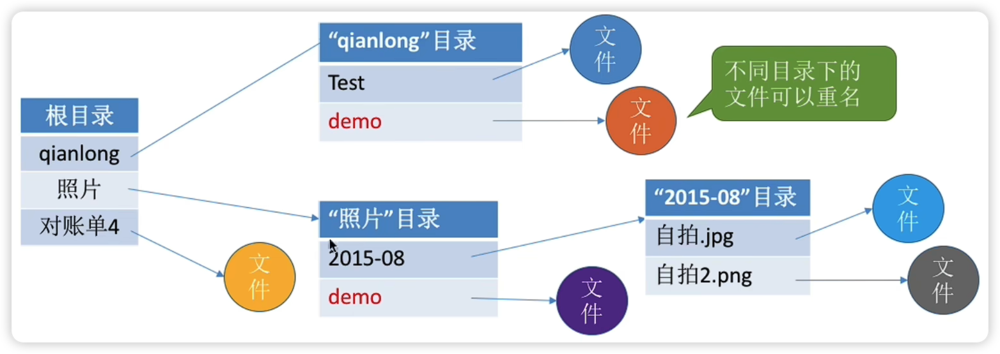
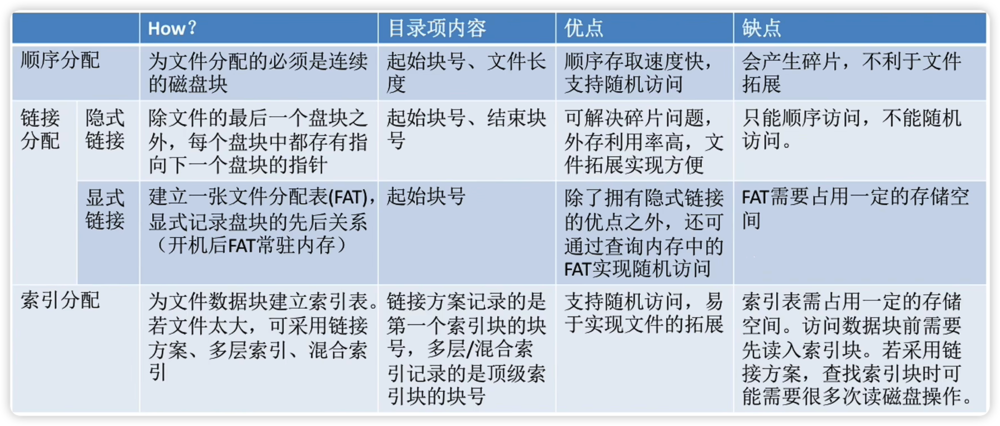
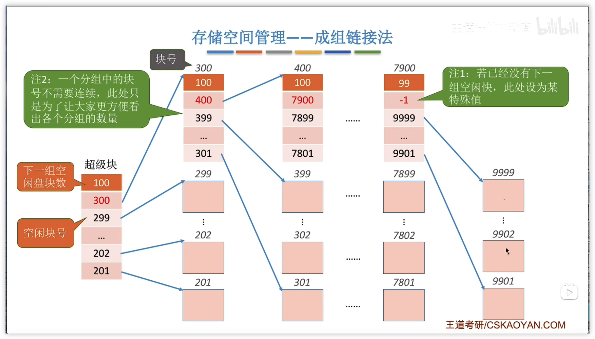
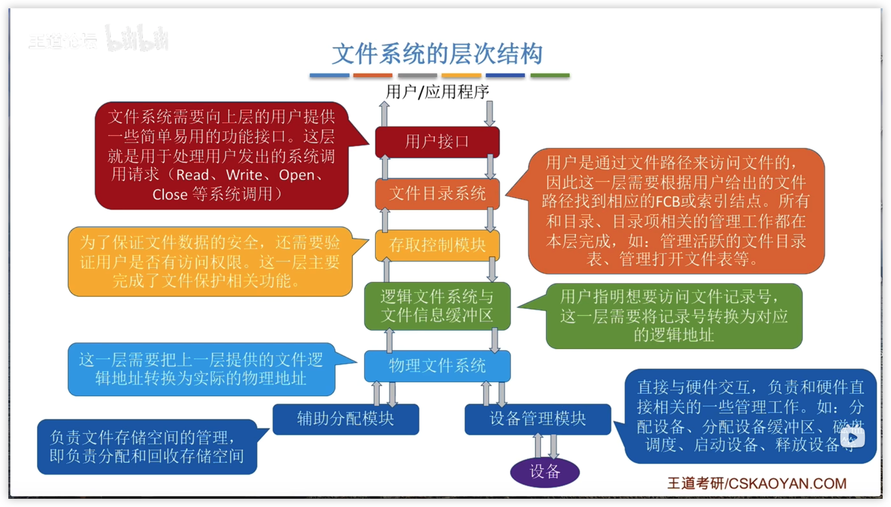
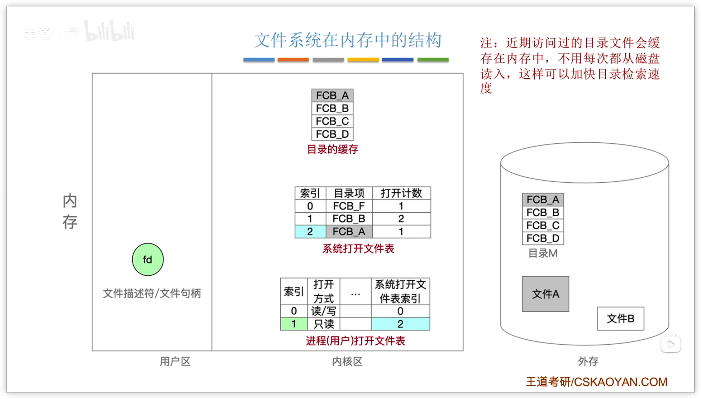

# 文件
## 初识文件管理

### 定义

一组有意义的信息的集合

### 文件属性

**文件名**：由创建文件的用户决定文件名，主要是为了方便用户找到文件，同一目录下不允许有重名文件  
**标识符**：一个系统内的各文件标识符唯一，对用户来说毫无可读性，因此标识符只是操作系统用于区分各个文件的一种内部名称  
**类型**：指明文件的类型  
**位置**：文件存放的路径（让用户使用）、在外存中的地址（操作系统使用，对用户不可见）

**大小**：指明文件大小  
**创建时间**  
**上次修改时间**  
**文件所有者信息**  
**保护信息**：对文件进行保护的访问控制信息

### 文件内部应该如何被组织起来

文件的逻辑结构

### 文件之间应该怎样组织起来

所谓的 **目录** 其实就是我们熟悉的 **文件夹**

用户可以自己创建一层一层的目录，各层目录中存放相应的文件。系统中的各个文件就通过一层一层的目录合理有序的组织起来了

目录其实也是一种特殊的有结构文件（由记录组成），如何实现文件目录是之后会重点探讨的问题

### 操作系统应该向上层提供哪些功能

- 创建文件（create系统调用）
- 删除文件（delete系统调用）
- 读文件（read系统调用）
- 写文件（write系统调用）
- 打开文件（open系统调用）读写之前一定要打开文件
- 关闭文件（close系统调用）读写之后一定要关闭文件

可以 **创建文件**，（点击新建后，图形化交互进程在背后调用了 **create 系统调用**）

可以 **读文件**，将文件数据读入内存，才能让CPU处理（双击后，*记事本* 应用程序通过操作系统提供的 **读文件** 功能，即 **read 系统调用**，将文件数据从外存读入内存，并显示在屏幕上）

可以 **写文件**，将更改过的文件数据写回外存（我们在“记事本”应用程序中编辑文件内容，点击 *保存* 后，*记事本* 应用程序通过操作系统提供的 **写文件** 功能，即 **write 系统调用**，将文件数据从内存写回外存）

可以 **删除文件**（点了 *删除* 之后，图形化交互进程通过操作系统提供的**删除文件** 功能，即 **delete 系统调用**，将文件数据从外存中删除）

### 文件应如何存放在外存中

文件的物理结构

### 操作系统如何管理外存中的空闲块

存储空间的管理

### 操作系统需要提供的其他文件管理功能

- 文件共享
- 文件保护

## 文件的逻辑结构

### 无结构文件

文件内部的数据就是一系列二进制流或字符流组成。又称 **流式文件**。如：Windows操作系统中的.txt文件

### 有结构文件

由一组相似的记录组成，又称 **记录式文件**。每条记录又若干个数据项组成。如：数据库表文件  
一般来说，每条记录有一个数据项可作为 **关键字**（作为识别不同记录的ID）  
根据各条记录的长度（占用的存储空间）是否相等，又可分为 **定长记录** 和 **可变长记录** 两种

#### 顺序文件

文件中的记录一个接一个地顺序排列（逻辑上），记录可以是 **定长** 的或 **可变长** 的。各个记录在物理上可以 **顺序存储** 或 **链式存储**

**串结构**

记录之间的顺序与关键字无关

**顺序结构**

记录之间的顺序按关键字顺序排列

- **链式存储**  
	无论是定长/可变长记录，都无法实现随机存取，每次只能从第一个记录开始依次往后查找
- **顺序存储**
	- *可变长记录*  
		无法实现随机存取。每次只能从第一个记录开始依次往后查找
	- *定长记录*
		- 可实现随机存取。记录长度为L，则第i个记录存放的相对位置是i\*L
		- 若采用串结构，无法快速找到某关键字对应的记录
		- 若采用顺序结构，可以快速找到某关键字对应的记录（如折半查找）

#### 索引文件

**索引表** 本身是 **定长记录的顺序文件**。因此可以快速找到第i个记录对应的索引项

可将关键字作为索引号内容，若按关键字顺序排列，则还可以支持按照关键字折半查找

每当要增加/删除一个记录时，需要对索引表进行修改。由于索引文件有很快的检索速度，因此 **主要用于对信息处理的及时性要求比较高的场合**

另外，**可以用不同的数据项建立多个索引表**。如：学生信息表中，可用关键字“学号”建立一张索引表。也可用“姓名”建立一张索引表。这样就可以根据“姓名”快速地检索文件了。（Eg:SQL 就支持根据某个数据项建立索引的功能）

#### 索引顺序文件

索引顺序文件是索引文件和顺序文件思想的结合。索引顺序文件中，同样会为文件建立一张索引表，但不同的是：并不是每个记录对应一个索引表项，而是 **一组记录对应一个索引表项**

若一个 **顺序文件** 有10000个记录，则根据关键字检索文件，只能从头开始顺序查找（这里指的并不是定长记录、顺序结构 的顺序文件），**平均须查找5000个记录**。若采用 **索引顺序文件** 结构，可把10000个记录分为 $\sqrt{10000}=100$ 组，每组100个记录。则需要先顺序查找索引表找到分组（共100个分组，因此索引表长度为100，平均需要查50次），找到分组后，再在分组中顺序查找记录（每个分组100个记录，因此平均需要查50次）。可见，采用索引顺序文件结构后，**平均查找次数减少为50+50=100次**

为了进一步提高检索效率，可以为顺序文件 **建立多级索引表**。例如，对于一个含 $10^6$ 个记录的文件，可先为该文件建立一张低级索引表，每100个记录一组，故低级索引表中共有10000个表项（即10000个定长记录），再把这10000个定长记录分组，每组100个，为其建立顶级索引表，故顶级索引表中共有100个表项

## 文件目录

### 文件控制块（FCB）

FCB 的有序集合称 **文件目录**，一个FCB就是一个文件 **目录项**

FCB 中包含了文件的 **基本信息**（**文件名**、**物理地址**、逻辑结构、物理结构等），存取控制信息（是否可读/可写、禁止访问的用户名单等），使用信息（如文件的建立时间、修改时间等）
**最重要**，**最基本** 的还是 **文件名、文件存放的物理地址**

#### 对目录的操作

**搜索**：当用户要使用一个文件时，系统要根据文件名搜索目录，找到该文件对应的目录项  
**创建文件**：创建一个新文件时，需要在其所属的目录中增加一个目录项  
**删除文件**：当删除一个文件时，需要在目录中删除相应的目录项  
**显示目录**：用户可以请求显示目录的内容，如显示该目录中的所有文件及相应属性  
**修改目录**：某些文件属性保存在目录中，因此这些属性变化时需要修改相应的目录项（如：文件重命名）

### 目录结构

#### 单级目录结构

早期操作系统并不支持多级目录，整个系统中只建立一张目录表，每个文件占一个目录项

单级目录实现了 *按名存取*，但是 **不允许文件重名**  
在创建一个文件时，需要先检查目录表中有没有重名文件，确定不重名后才能允许建立文件，并将新文件对应的目录项插入目录表中

显然，单级目录结构不适用于多用户操作系统

#### 两级目录结构

早期的多用户操作系统，采用两级目录结构。分为 **主文件目录**（MFD,Master File Directory）和 **用户文件目录**（UFD，User File Directory）

不同用户的文件可以重名，但 **不能对文件进行分类**

#### 多级目录结构（树形目录结构）

用户（或用户进程）要访问某个文件时要用文件路径名标识文件，文件路径名是个字符串。各级目录之间用“/”隔开。**从根目录出发** 的路径称为 **绝对路径**

系统根据绝对路径一层一层地找到下一级目录。刚开始 **从外存读入根目录的目录表**；找到“照片”目录的存放位置后，**从外存读入对应的目录表**；再找到“2015-08”目录的存放位置，再 **从外存读入对应目录表**；最后才找到文件“自拍.jpg”的存放位置。整个过程 **需要3次读磁盘I/O操作**

很多时候，用户会连续访问同一目录内的多个文件（比如：接连查看“2015-08”目录内的多个照片文件）显然，每次都从根目录开始查找，是很低效的。因此可以设置一个 **当前目录**

例如，此时己经打开了“照片”的目录文件，也就是说，这张目录表已调入内存，那么可以把它设置 **当前目录**。当用户想要访问某个文件时，可以使用 **从当前目录出发** 的 **相对路径**

**树形目录结构** 可以很方便地对文件进行分类，层次结构清晰，也能够更有效地进行文件的管理和保护。但是，树形结构 **不便于实现文件的共享**。此，提出了 **无环图目录结构**

#### 无环图目录结构

在树形目录结构的基础上，增加一些指向同一节点的有向边，使整个目录成为一个 [有向无环图](../数据结构(考试)/图形结构.md#AOV网)。可以更方便地实现多个用户间的文件共享

**可以用不同的文件名指向同一个文件**，甚至可以指向同一个目录（共享同一目录下的所有内容）

需要为 **每个共享结点设置一个共享计数器**，用于记录此时有多少个地方在共享该结点。用户提出删除结点的请求时，只是删除该用户的FCB、并使 **共享计数器减1**，并不会直接删除共享结点，计数器为0时才真正删除该结点

>[!Caution] 注意
>共享文件不同于复制文件。在 **共享文件中，由于各用户指向的是同一个文件，因此只要其中一个用户修改了文件数据，那么所有用户都可以看到文件数据的变化**

### 索引结点（FCB的改进）

其实在查找各级目录的过程中只需要用到 *文件名* 这个信息，只有文件名匹配时，才需要读出文件的其他信息。因此可以考虑让目录表 **瘦身** 来提升效率

当找到文件名对应的目录项时，才需要将索引结点调入内存，索引结点中记录了文件的各种信息，包括文件在外存中的存放位置，根据“存放位置”即可找到文件

存放 **在外存中** 的索引结点称为 *磁盘索引结点*，当索引结点放入内存后称为 *内存索引结点*  
相比之下 **内存索引结点中需要增加一些信息**，比如：文件是否被修改、此时有几个进程正在访问该文件等

由于目录项长度减小，因此每个磁盘块可以存放更多个目录项，因此检索文件时磁盘I/O的次数就少了很多

## 文件的物理结构

在内存管理中，进程的逻辑地址空间被分为一个一个页面  
同样的，在外存管理中，为了方便对文件数据的管理，**文件的逻辑地址空间也被分为了一个一个的文件“块”**

于是文件的逻辑地址也可以表示为（**逻辑块号，块内地址**）的形式

### 连续分配

**连续分配** 方式要求 **每个文件在磁盘上占有一组连续的块**

用户给出要访问的逻辑块号，操作系统找到该文件对应的目录项（FCB）  
**物理块号 = 起始块号 + 逻辑块号**  
当然，还需要检查用户提供的逻辑块号是否合法（逻辑块号≥长度 就不合法）

可以直接算出逻辑块号对应的物理块号，因此 **连续分配支持顺序访间和直接访问。（即随机访间）**

读取某个磁盘块时，需要移动磁头。访问的两个磁盘块相隔越远，移动磁头所需时间就越长

**连续分配的文件在顺序读/写时速度最快**

---

**缺点**

物理上采用连续分配的文件不方便拓展

物理上采用连续分配，存储空间利用率低，会产生难以利用的磁盘碎片  
可以用紧凑来处理碎片，但是需要耗费很大的时间代价

### 链接分配

#### 隐式链接

目录中记录了文件存放的起始块号和结束块号。当然，也可以增加一个字段来表示文件的长度

除了文件的最后一个磁盘块之外，每个磁盘块中都会保存指向下一个盘块的指针，这些指针对用户是 **透明的** ^[透明：看不到]

**缺点**

采用 **链式分配（隐式链接）** 方式的文件，**只支持顺序访问，不支持随机访问**，查找效率低。另外，指向下一个盘块的指针也需要耗费少量的存储空间

**优点**

采用隐式链接的 **链接分配方式，很方便文件拓展**。另外，所有的空闲磁盘块都可以被利用，**不会有碎片问题，外存利用率高**

#### 显式链接

把用于链接文件各物理块的指针显式地存放在一张表中。即 **文件分配表** （FAT, File Allocation Table）

目录中只需记录文件的起始块号

>[!Caution] 注意
>**一个磁盘仅设置一张FAT。开机时，将FAT读入内存，并常驻内存**。FAT 的各个表项在物理上连续存储，且每一个表项长度相同，因此 *物理块号* 字段可以是 **隐含的**

从目录项中找到起始块号，若i>0，则查询内存中的文件分配表FAT，往后找到i号逻辑块对应的物理块号。**逻辑块号转换成物理块号的过程不需要读磁盘操作**

采用 **链式分配（显式链接）** 方式的文件，支持顺序访问，也 **支持随机访问（想访问i号逻辑块时，并不需要依次访问之前的0~i-1号逻辑块）**，由于块号转换的过程不需要访问磁盘，因此相比于隐式链接来说，访问速度快很多。

显然，显式链接也 **不会产生外部碎片，也可以很方便地对文件进行拓展**

### 索引分配

 **索引分配** 允许文件离散地分配在各个磁盘块中，系统会为 **每个文件建立一张索引表**，索引表中 **记录了文件的各个逻辑块对应的物理块**（索引表的功能类似于内存管理中的页表--建立逻辑页面到物理页之间的映射关系）。索引表存放的磁盘块称为 **索引块**。文件数据存放的磁盘块称 **数据块**

用户给出要访问的逻辑块号i，操作系统找到该文件对应的目录项（FCB）

从目录项中可知索引表存放位置，将索引表从外存读入内存，并查找索引表即可只i号逻辑块在外存中的存放位置

可见，**索引分配方式可以支持随机访问**。**文件拓展也很容易实现**（只需要给文件分配一个空闲块，并增加一个索引表项即可）

但是 **索引表需要占用一定的存储空间**

#### 解决一个磁盘快放不下文件的整张索引表

##### 链接方案

如果索引表太大，一个索引块装不下，那么可以将多个索引块链接起来存放

##### 多层索引

建立多层索引（**原理类似于多级页表**）。使第一层索引块指向第二层的索引块。还可根据文件大小的要求再建立第三层、第四层索引块

假设磁盘块大小1KB，一个索引表项占4B，则一个磁盘块只能存放256个索引项

若某文件采用 **两层索引**，则该 **文件的最大长度** 可以到 $256*256*1KB=65536KB=64MB$

**访问目标数据块，需要3次磁盘I/IO**

采用K层索引结构，且 **顶级索引表未调入内存**，则访问一个数据块只需要K+1次读磁盘操作

##### 混合索引

多种索引分配方式的结合。例如，一个文件的顶级索引表中，既包含 **直接地址索引**（直接指向数据块），又包含 **一级间接索引**（指向单层索引表）、还包含 **两级间接索引**（指向两层索引表）

>[!Caution] 超级超级超级重要考点
1. 要会根据多层索引、混合索引的结构计算出文件的最大长度（**Key**：各级索引表最大不能超过一个块）
2. 要能自己分析访问某个数据块所需要的读磁盘次数（**Key**：FCB中会存有指向顶级索引块的指针，因此可以根据FCB读入顶级索引块。每次读入下一级的索引块都需要一次读磁盘操作。另外，要 **注意题目条件--顶级索引块是否已调入内存**）

## 逻辑结构VS物理结构

- **逻辑结构**
	- 用户（文件创建者）的视角看到的样子
	- 在用户看来，整个文件占用连续的逻辑地址空间
	- 文件内部的信息组织完全由用户自己决定，操作系统并不关心
- **物理结构**
	- 由操作系统决定文件采用什么物理结构存储
	- 操作系统负责将逻辑地址转变为（逻辑块号，块内偏移量）的形式，并负责实现逻辑块号到物理块号的映射

## 文件存储空间管理

### 存储空间的划分与初始化
#### 文件卷（逻辑卷）的概念

**存储空间的划分**：将物理磁盘划分为一个个文件卷（逻辑卷、逻辑盘）

有的系统支持超大型文件，可支持由多个物理磁盘组成一个文件卷

#### 目录区与文件区

**存储空间的初始化**：将各个文件卷划分为目录区、文件区

**目录区** 主要存放文件目录信息（FCB）、用于磁盘存储空间管理的信息

**文件区** 用于存放文件数据

### 管理方法

#### 空闲表法

**如何分配磁盘块**：与内存管理中的动态分区分配很类似，为一个文件分配 **连续的存储空间**。同样可采用 [首次适应](内存管理.md#首次适应算法)、[最佳适应](内存管理.md#最佳适应算法)、[最坏适应](内存管理.md#最坏适应算法) 等算法来决定要为文件分配哪个区间

**如何回收磁盘块**：与内存管理中的动态分区分配很类似，当回收某个存储区时需要有四种情况:

1. 回收区的前后都没有相邻空闲区
2. 回收区的前后都是空闲区
3. 回收区前面是空闲区
4. 回收区后面是空闲区

**总之，回收时需要注意表项的合并问题**

#### 空闲链表法

##### 空闲盘块链

以盘块为单位组成一条空闲链

操作系统保存着 **链头、链尾指针**  
**如何分配**：若某文件申请K个盘块，则从链头开始依次摘下K个盘块分配，并修改空闲链的链头指针  
**如何回收**：回收的盘块依次挂到链尾，并修改空闲链的链尾指针

##### 空闲盘区链

以盘区为单位组成一条空闲链

操作系统保存着 **链头、链尾指针**
**如何分配**：若某文件申请K个盘块，则可以采用 [首次适应](内存管理.md#首次适应算法)、[最佳适应](内存管理.md#最佳适应算法)、[最坏适应](内存管理.md#最坏适应算法) 等算法，从链头开始检索，按照算法规则找到一个大小符合要求的空闲盘区，分配给文件。若没有合适的连续空闲块，也可以将不同盘区的盘块同时分配给一个文件，注意分配后可能要修改相应的链指针、盘区大小等数据
**如何回收**：若回收区和某个空闲盘区相邻，则需要将回收区合并到究闲盘区中。若回收区没有和任何空闲区相邻，将回收区作为单独的一个空闲盘区挂到链尾

#### 位示图法

每个二进制位对应一个盘块。在本例中，“0”代表盘块空闲，“1”代表盘块已分配。位示图一般用 **连续的字** 来表示，如本例中一个字的字长是16位，字中的每一位对应一个盘块。因此 **可以用（字号，位号）对应一个盘块号**。当然有的题目中也描述为 **（行号，列号）**

>[!Caution] 重要重要重要
>要能自己推出盘块号与（字号，位号）相互转换的公式
>**注意题目条件**：盘块号、字号、位号到底是从0开始还是从1开始

$n$ 表示字长

$$盘块号b=ni+j$$

$b$ 号盘块对应的

$$\begin{align}字号i&=b/n\\位号j&=b\%n\end{align}$$

**如何分配**：若文件需要K个块

1. 顺序扫描位示图，找到K个相邻或不相邻的“0”
2. 根据字号、位号算出对应的盘块号，将相应盘块分配给文件
3. 将相应位设置为“1”

**如何回收**：

1. 根据回收的盘块号计算出对应的字号、位号
2. 将相应二进制位设为“0”

#### 成组链接法

空闲表法、空闲链表法不适用于大型文件系统，因为空闲表或空闲链表可能过大。UNIX系统中采用了 **成组链接法** 对磁盘空闲块进行管理

文件卷的目录区中专门用一个磁盘块作为“**超级块**”，当系统启动时需要将 **超级块读入内存**。并且要保证内存与外存中的“超级块”数据一致

**如何分配**

Eg：需要100个空闲块

1. 检查第一个分组的块数是否足够。100=100，是足够的
2. 分配第一个分组中的100个空闲块。但是由于300号块内存放了再下一组的信息，因此300号块的数据需要复制到超级块中

## 文件的基本操作

### 创建文件（create系统调用）

进行 Create 系统调用时，需要提供的几个主要参数：

1. 所需的外存空间大小（如：一个盘块，即1KB）
2. 文件存放路径（“D:/Demo”）
3. 文件名（这个地方默认“新建文本文档.txt”）

操作系统在处理 Create 系统调用时，主要做了两件
事：

1. **在外存中找到文件所需的空间**（结合上小节学习的空闲链表法、位示图、成组链接法等管理策略，找到空闲空间）
2. 根据文件存放路径的信息找到该目录对应的目录文件（此处就是 D:/Demo 目录），在目录中 **创建该文件对应的目录项**。目录项中包含了文件名、文件在外存中的存放位置等信息

### 删除文件（delete系统调用）

进行 Delete 系统调用时，需要提供的几个主要参数：

1. 文件存放路径（“D:/Demo”）
2. 文件名（“test.txt”）

操作系统在处理 Delete 系统调用时，主要做了几件事

1. 根据文件存放路径找到相应的目录文件，从目录中 **找到文件名对应的目录项**
2. 根据该目录项记录的文件在外存的存放位置、文件大小等信息，**回收文件占用的磁盘块**。（回收磁盘块时，根据空闲表法、空闲链表法、位图法等管理策略的不同，需要不同的处理）
3. 从目录表中 **删除文件对应的目录项**

### 打开文件（open系统调用）

在很多操作系统中，在对文件进行操作之前，要求用户先使用 open 系统调用“打开文件”，需要提供的几个主要参数：

1. 文件存放路径（“D:/Demo”）
2. 文件名（“test.txt”）
3. 要对文件的操作类型（如：r 只读；rw 读写等）

操作系统在处理 open 系统调用时，主要做了几件事：

4. 根据文件存放路径找到相应的目录文件，从目录中 **找到文件名对应的的目录项**，并检查该用户是否有指定的操作权限
5. **将目录项复制到内存中的“打开文件表”中**。并将对应表目的编号返回给用户。之后 **用户使用打开文件表的编号来指明要操作的文件**

可以方便实现某些文件管理的功能。例如：在Windows系统中，我们尝试删除某个txt文件，如果此时该文件已被某个“记事本”进程打开，则系统会提示我们“暂时无法删除该文件”。其实系统在背后做的事就是先检查了系统打开文件表，确认此时是否有进程正在使用该文件

### 关闭文件（close系统调用）

进程使用完文件后，要“关闭文件”操作系统在处理Close 系统调用时，主要做了几件事：

1. 将进程的打开文件表相应表项删除
2. 回收分配给该文件的内存空间等资源
3. 系统打开文件表的打开计数器count 减1，若 count=0，则删除对应表项

### 读文件（read系统调用）

进程使用read系统调用完成读操作。需要指明是哪个文件（在支持“打开文件”操作的系统中，只需要提供文件在打开文件表中的索引号即可），还需要指明要读入多少数据（如：读入 1KB）、指明读入的数据要放在内存中的什么位置

操作系统在处理read 系统调用时，会从读指针指向的外存中，将用户指定大小的数据读入用户指定的内存区域中

### 写文件（write系统调用）

进程使用 write 系统调用完成写操作，需要指明是哪个文件（在支持“打开文件”操作的系统中，只需要提供文件在打开文件表中的索引号即可），还需要指明要写出多少数据（如：写出1KB）、写回外存的数据放在内存中的什么位置操作系统在处理 write 系统调用时，会从用户指定的内存区域中，将指定大小的数据写回写指针指向的外存

## 文件共享

### 基于索引结点的共享方式（硬链接）

索引结点中设置一个链接计数变量count，用于表示链接到本索引结点上的用户目录项数  
若 count=2，说明此时有两个用户目录项链接到该索引结点上，或者说是有两个用户在共享此文件  
若某个用户决定“删除”该文件，则只是要把用户目录中与该文件对应的目录项删除，且索引结点的count值减1  
若 count>0，说明还有别的用户要使用该文件，暂时不能把文件数据删除，否则会导致指针悬空  
当 count=0时系统负责删除文件

### 基于符号链的共享方式（软链接）

在一个 Link 型的文件中记录共享文件的存放路径（Windows 快捷方式）  
操作系统根据路径一层层查找目录，最终找到共享文件  
即使软链接指向的共享文件已被删除，Link 型文件依然存在，只是通过 Link 型文件中的路径去查找共享文件会失败（找不到对应目录项）  
由于用软链接的方式访问共享文件时要查询多级目录，会有多次磁盘I/O，因此用软链接访问的速度比硬链接慢

## 文件保护

### 口令保护

口令一般存放在文件对应的FCB 或索引结点中。用户访问文件前需要先输入“口令”，操作系统会将用户提供的口令与FCB中存储的口令进行对比，如果正确，则允许该用户访问文件

**优点**：保存口令的空间开销不多，验证口令的时间开销也很小  
**缺点**：正确的“口令”存放在系统内部，不够安全

### 加密保护

使用某个“密码”对文件进行加密，在访问文件时需要提供正确的“密码”才能对文件进行正确的解密

### 访问控制

在每个文件的FCB（或索引结点）中增加一个 **访问控制列表**（Access-Control List, ACL），该表中记录了各个用户可以对该文件执行哪些操作

实现灵活，可以实现复杂的文件保护功能

**访问类型**

读：从文件中读数据  
写：向文件中写数据  
执行：将文件装入内存并执行  
添加：将新信息添加到文件结尾部分  
删除：删除文件，释放空间  
列表清单：列出文件名和文件属性

**精简的访问列表**：以“组”为单位，标记各“组”用户可以对文件执行哪些操作  
如：分为系统管理员、文件主、文件主的伙伴、其他用户 几个分组  
当某用户想要访问文件时，系统会检查该用户所属的分组是否有相应的访问权限

# ****

## 文件系统的层次结构

## 文件系统布局

原始磁盘 $\ra$ 物理格式化 $\ra$ 逻辑格式化

物理格式化，即低级格式化一一划分扇区，检测坏扇区，并用备用扇区替换坏扇区  
磁盘分区（分卷 Volume）后，逻辑格式化，完成各分区的文件系统初始化  
注：逻辑格式化后，灰色部分就有实际数据了，白色部分还没有数据

##  虚拟文件系统（VFS）

**特点**：

1. 向上层用户进程提供统一标准的系统调用接口，屏蔽底层具体文件系统的实现差异
2. VFS要求下层的文件系统必须实现某些规定的函数功能，如：open/read/write。一个新的文件系统想要在某操作系统上被使用，就必须满足该操作系统VFS的要求
3. 每打开一个文件，VFS就在主存中新建一个 vnode，用统一的数据结构表示文件，无论该文件存储在哪个文件系统

### 文件系统挂载（mounting）

文件系统挂载要做的事：

1. 在VFS中注册新挂载的文件系统。**内存中的挂载表**（mount table）包含每个文件系统的相关信息，包括文件系统类型、容量大小等
2. 新挂载的文件系统，要向VFS提供一个 **函数地址列表**
3. 将新文件系统加到 **挂载点**（mount point），也就是将新文件系统挂载在某个父目录下

