# I/O设备

## I/O设备的概念与分类

**I/O** 就是 **输入/输出（Input/Output）**  
**I/O 设备** 就是可以将数据输入到计算机，或者可以接收计算机输出数据的外部设备，属于计算机中的硬件部件

UNIX系统将外部设备抽象为一种特殊的文件，用户可以使用与文件操作相同的方式对外部设备进行操作

## I/O 设备的分类

### 按使用特性

- **人机交互外部设备**：鼠标、键盘、打印机等
- **存储设备**：移动硬盘、光盘等
- **网络通信设备**：调制解调器

### 按传输速率

- **低速设备**：鼠标、键盘等 *每秒几个到几百个字节*
- **中速设备**：激光打印机等 *每秒数千至上万个字节*
- **高速设备**：磁盘等 *每秒数千字节至千兆字节*

### 按信息交换的单位

- **块设备**：磁盘等 *传输速率较高，可寻址，即对它可随机地读/写任一块*
- **字符设备**：鼠标、键盘等 *传输速率较慢，不可寻址，在输入/输出时常采用中断驱动方式*

## I/O控制器

### 机械部件

I/O 设备的 **机械部件** 主要用来执行具体 I/O 操作  
如我们看得见摸得着的鼠标/键盘的按钮；显示器的LED屏；移动硬盘的磁臂、磁盘盘面

I/O 设备的 **电子部件** 通常是一块插入主板扩充槽的印刷电路板

### 电子部件（I/O控制器）

CPU无法直接控制 I/O 设备的机械部件，因此 I/O 设备还要有一个 **电子部件** 作为CPU和 I/O 设备机械部件之间的 **中介**，用于实现CPU对设备的控制  
这个电子部件就是 **I/O 控制器**，又称 **设备控制器**。CPU可控制 I/O 控制器，又由 I/O 控制器来控制设备的机械部件

**功能**

- **接收和识别CPU发出的命令**  
	如CPU发来的 read/write 命令，I/O 控制器中有相应的 *控制寄存器* 来存放命令和参数
- **向CPU报告设备的状态**  
	I/O 控制器中会有相应的 *状态寄存器*，用于记录I/0设备的当前状态。如：1表示空闲，0表示忙碌
- **数据交换**  
	I/O 控制器中会设置相应的 *数据寄存器*。输出时，数据寄存器用于暂存CPU发来的数据，之后再由控制器传送设备。输入时，数据寄存器用于暂存设备发来的数据，之后CPU从数据寄存器中取走数据
- **地址识别**  
	类似于内存的地址，为了区分设备控制器中的各个寄存器，也需要给各个寄存器设置一个特定的 *地址*。I/O 控制器通过CPU提供的 *地址* 来判断CPU要读/写的是哪个寄存器

### 组成

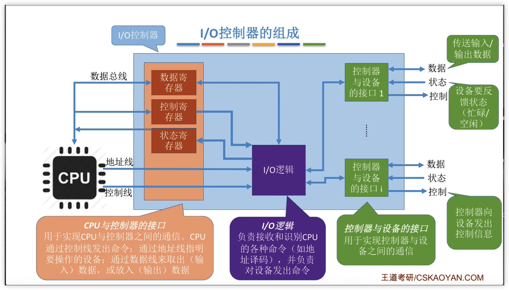

**注意的小细节**：

1. 一个 I/O 控制器可能会对应多个设备
2. 数据寄存器、控制寄存器、状态寄存器可能有多个（如：每个控制/状态寄存器对应一个具体的设备），且这些寄存器都要有相应的地址，才能方便CPU操作。有的计算机会让这些寄存器占用内存地址的一部分，称为 **内存映像 I/O**；另一些计算机则采用 I/O 专用地址，即 **寄存器独立编址**

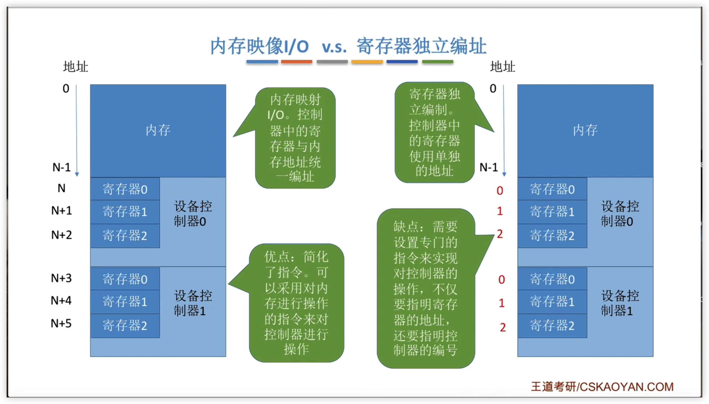

## I/O 控制方式

**需要注意的问题**：

1. 完成一次读/写操作的流程
2. CPU干预的频率
3. 数据传送的单位
4. 数据的流向
5. 主要缺点和主要优点

### 程序直接控制方式

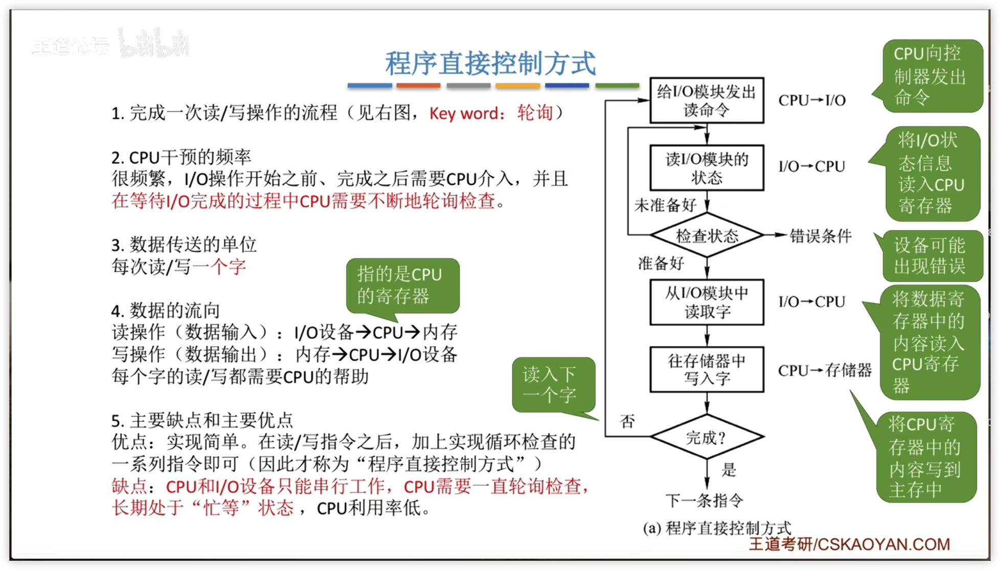

### 中断驱动方式

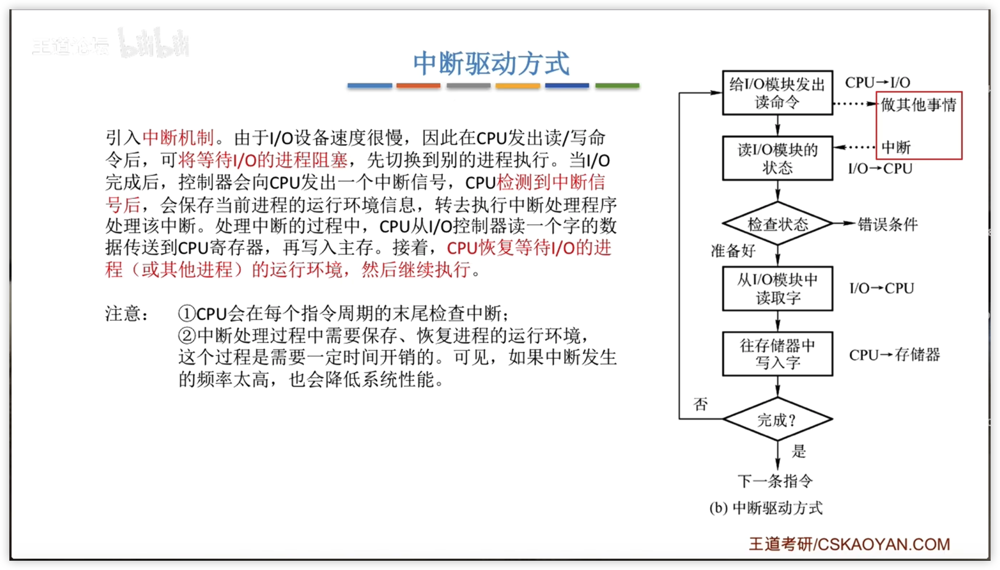

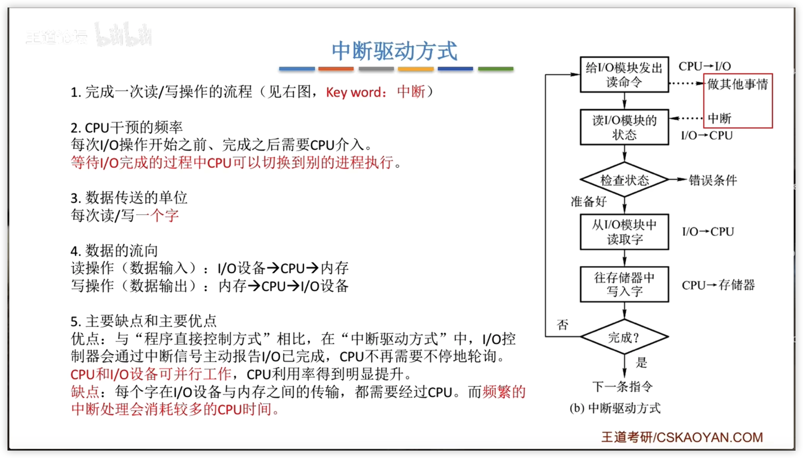

### DMA方式

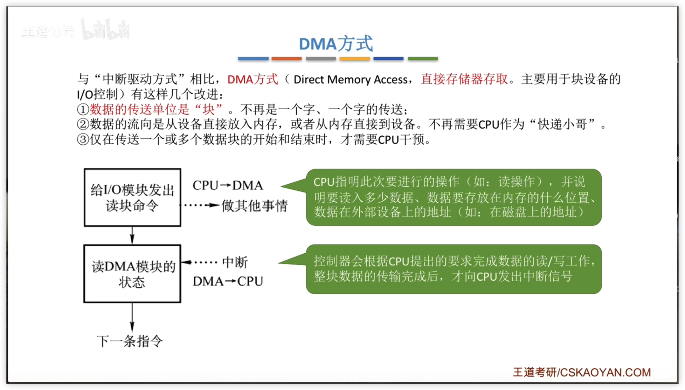

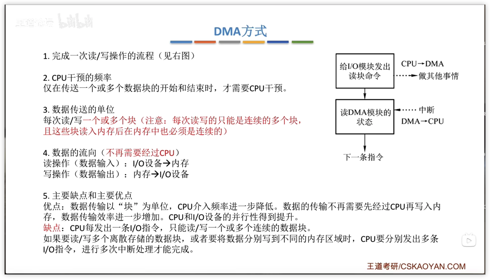

#### DMA控制器

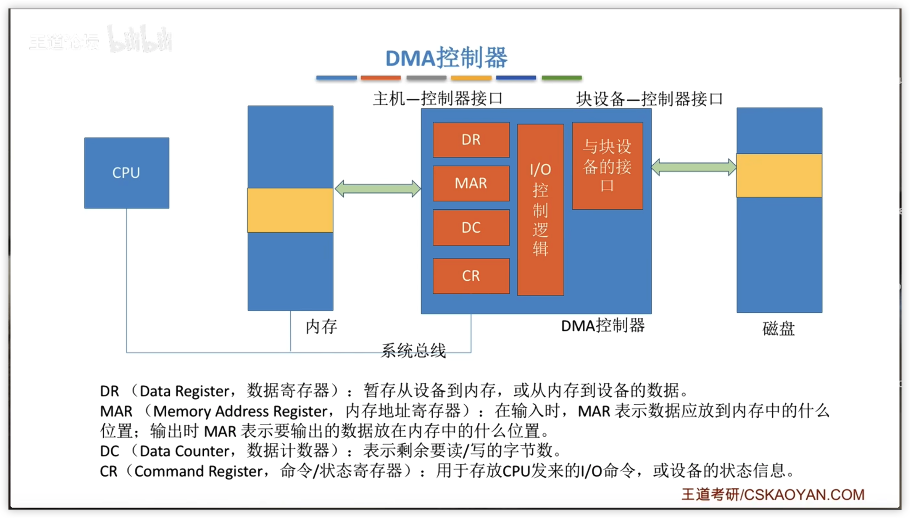

### 通道控制方式

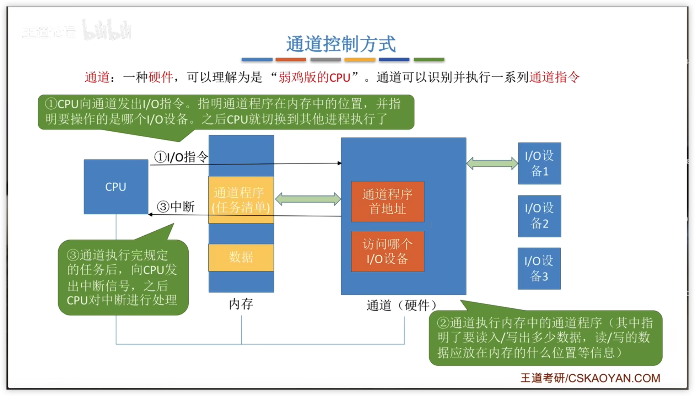

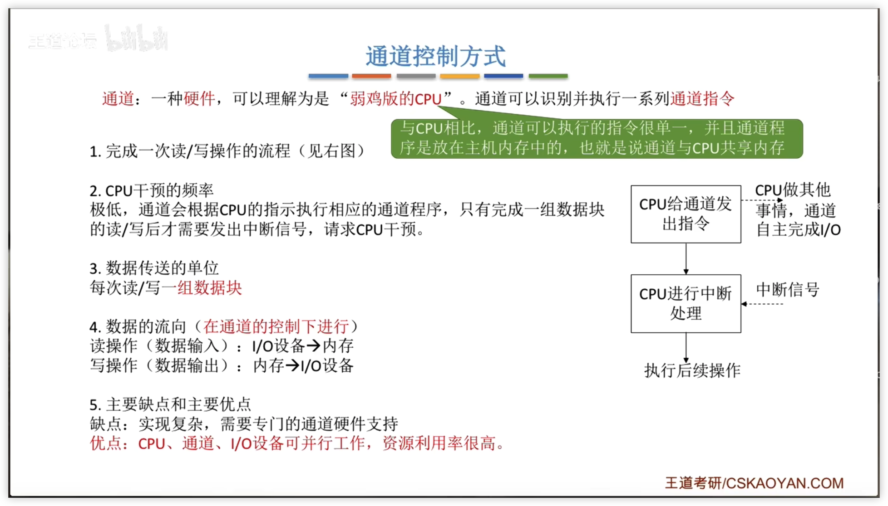

### 总结

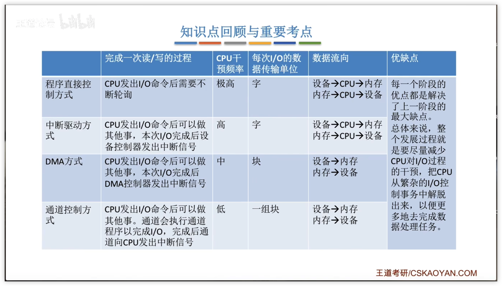

## I/O 软件层次结构

### 用户层软件

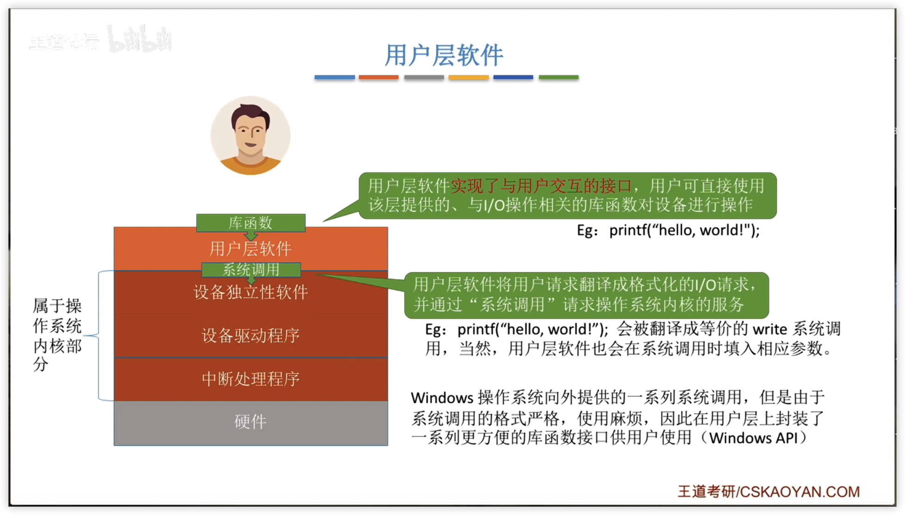

### 设备独立性软件

又称 **设备无关性软件**。与设备的硬件特性无关的功能几乎都在这一层实现

**主要实现的功能**：

1. 向上层提供统一的调用接口（如 read/write 系统调用）
2. 设备的保护  
	原理类似文件保护。设备被看做是一种特殊的文件，不同用户对各个文件的访问权限是不一样的，同理，对设备的访问权限也不一样
3. 差错处理
4. 设备的分配与回收
5. 数据缓冲区管理  
	可以通过缓冲技术屏蔽设备之间数据交换单位大小的传输速度的差异
6. 建立逻辑设备名到物理设备名的映射关系；根据设备类型选择调用相应的驱动程序  
	用户或用户层软件发出 I/O 操作相关系统调用的系统调用时，需要指明此次要操作的 I/O 设备的逻辑设备名（eg：去学校打印店打印时，需要选择打印机1/打印机2/打印机3，其实这些都是 **逻辑设备名**）
	
	**设备独立性软件** 需要通过 **逻辑设备表（LUT，Logical UnitTable）** 来确定逻辑设备对应的 **物理设备**，并找到该设备对应的 **设备驱动程序**
	
	操作系统系统可以采用两种方式管理 **逻辑设备表（LUT）**：
	
	- 第一种方式，**整个系统只设置一张LUT**，这就意味着所有用户不能使用相同的逻辑设备名，因此这种方式只适用于单用户操作系统
	- 第二种方式，**为每个用户设置一张LUT**，各个用户使用的逻辑设备名可以重复，适用于多用户操作系统。系统会在用户登录时为其建立一个用户管理进程，而LUT就存放在用户管理进程的PCB中

### 设备驱动程序

主要负责对硬件设备的具体控制，将上层发出的一系列命令（如read/write）转化成特定设备 *能听得懂* 的一系列操作。包括设置设备寄存器；检查设备状态等

不同的 I/O 设备有不同的硬件特性，具体细节只有设备的厂家才知道。因此厂家需要根据设备的硬件特性设计并提供相应的驱动程序

### 中断处理程序

当 I/O 任务完成时，I/O 控制器会发送一个 **中断信号**，系统会 **根据中断信号类型** 找到相应的 **中断处理程序** 并执行

### 硬件

执行 I/O 操作，有机械部件、电子部件组成 [链接](#io控制器)

## 输入/输出管理

### 输入/输出应用程序接口

**字符设备接口**

get/put 系统调用：向字符设备读/写一个字符

**块设备接口**

reed/write 系统调用：向块设备的 *读写指针位置* 读/写多个字符  
seek系统调用：*修改读写指针位置*

**网络设备接口**

又称“**网络套接字（socket）接口**”

socket 系统调用：*创建一个网络套接字*，需指明网络协议（TCP?UDP？）  
bind：将套接字绑定到某个本地“端口”  
connect：将套接字连接到远程地址  
read/write：从套接字读/写数据

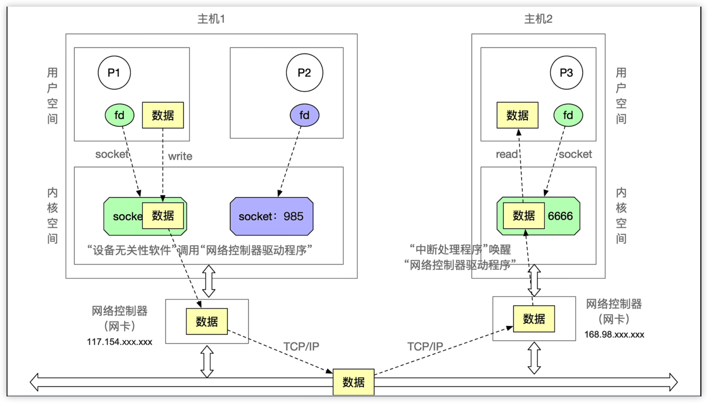

#### 阻塞/非阻塞I/O

**阻塞I/O**：应用程序发出 I/O 系统调用，进程需转为阻塞态等待  
eg：字符设备接口--从键盘读一个字符get  
**非阻塞I/O**：应用程序发出 I/O 系统调用，系统调用可迅速返回，进程无需阻塞等待  
eg：块设备接口--往磁盘写数据write

### 设备驱动程序接口

不同的操作系统，对设备驱动程序接口的标准各不相同  
设备厂商必须根据操作系统的接口要求，开发相应的设备驱动程序，设备才能被使用

#  I/O 核心子系统

##  I/O 调度

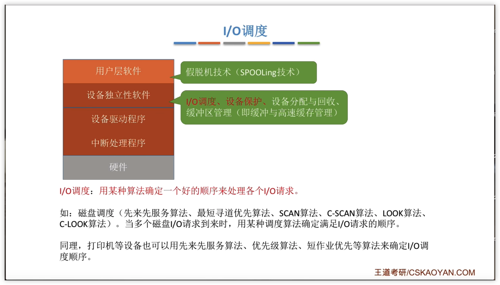

## 设备保护

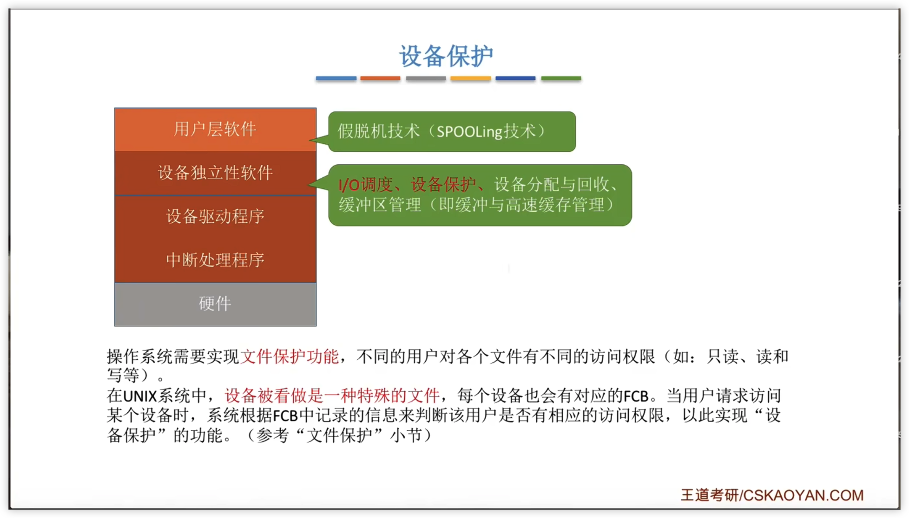

## 假脱机技术

**脱机**：脱离主机的控制进行输入/输出

**手工操作阶段**：主机直接从1/0设备获得数据，由于设备速度慢，主机速度很快。人机速度矛盾明显，主机要浪费很多时间来等待设备

**批处理阶段**：引入了脱机输入/输出技术（用磁带完成）：

### 假脱机实现原理

**假脱机技术**，又称 **SPOOLing 技术** 是用软件的方式模拟脱机技术。SPOOLing 系统的组成如下：

**作用**：缓解设备与CPU的速度矛盾，实现预输入、缓输出

#### 输入井和输出井

**磁盘**：开辟出两个存储区域-- *输入井* 和 *输出井*

**输入井**：模拟脱机输入时的磁带，用于收容 I/O 设备输入的数据

**输出井**：模拟脱机输出时的磁带，用于收容用户进程输出的数据

#### 输入进程和输出进程

**输入进程**：模拟脱机输入时的外围控制机

**输出进程**：模拟脱机输出时的外围控制机

#### 输入缓冲区和输出缓冲区

**注意**：*输入缓冲区* 和。*输出缓冲区* 是在内存中的缓冲区

在输入进程的控制下，**输入缓冲区** 用于暂存从输入设备输入的数据，之后再转存到输入井中

在输出进程的控制下，**输出缓冲区** 用于暂存从输出井送来的数据，之后再传送到输出设备上

## 设备的分配与回收

### 设备分配时应考虑的因素

**设备的固有属性**：

- *独占设备*：一个时段只能分配给一个进程
- *共享设备*：可同时分配给多个进程使用（如磁盘），各进程往往是宏观上同时共享使用设备，而微观上交替使用
- *虚拟设备*：采用 SPOOLing 技术将独占设备改造成虚拟的共享设备，可同时分配给多个进程使用（如采用SPOOLing技术实现的共享打印机）

**设备分配算法**：先来先服务、优先级高者优先、短任务优先

**设备分配中的安全性**

- *安全分配方式*：进程分配一个设备后就将进程阻塞，本次 I/O 完成后才将进程唤醒。（eg：考虑进程请求打印机打印输出的例子）
	一个时段内每个进程只能使用一个设备
	- *优点*：破坏了 *请求和保持* 条件，不会死锁
	- *缺点*：对于一个进程来说，CPU和 I/O 设备只能串行工作
- *不安全分配方式*：进程发出 I/O 请求后，系统为其分配 I/O 设备，进程可继续执行，之后还可以发出新的 I/O 请求。只有某个 I/O 请求得不到满足时才将进程阻塞
	一个进程可以同时使用多个设备
	- *优点*：进程的计算任务和 I/O 任务可以并行处理，使进程迅速推进
	- *缺点*：有可能发生 **[死锁](进程管理.md#死锁)**（死锁避免、死锁的检测和解除）

### 静态分配与动态分配

**静态分配**：进程运行前为其分配全部所需资源，运行结束后归还资源  
**动态分配**：进程运行过程中动态申请设备资源

### 设备分配管理中的数据结构

一个通道可控制多个设备控制器，每个设备控制器可控制多个设备

**设备控制表（DCT）**

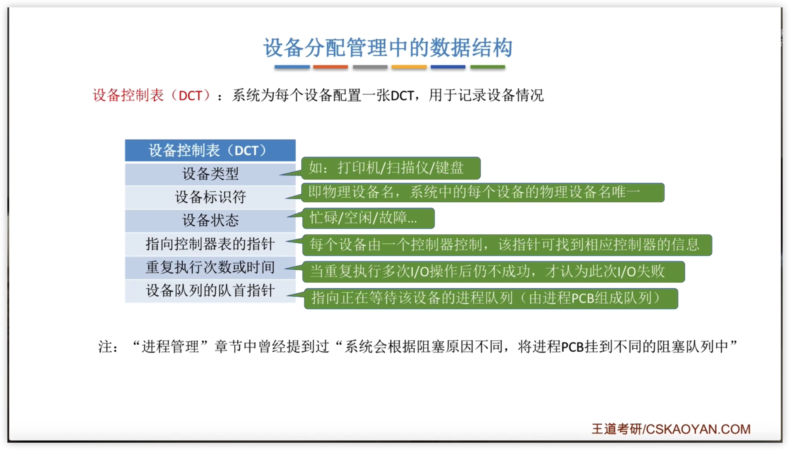

**控制器控制表（COCT）**

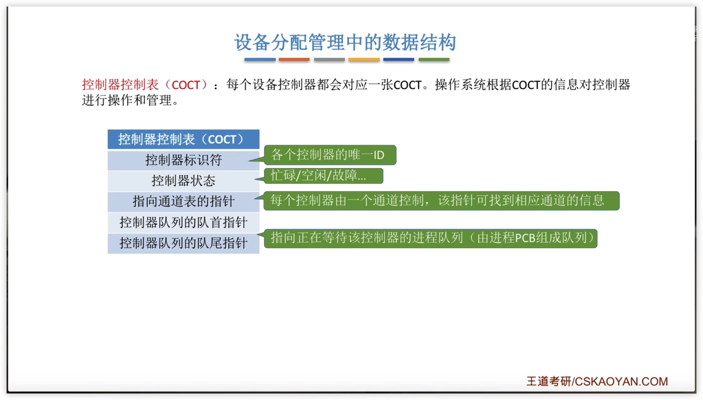

**通道控制表（CHCT）**

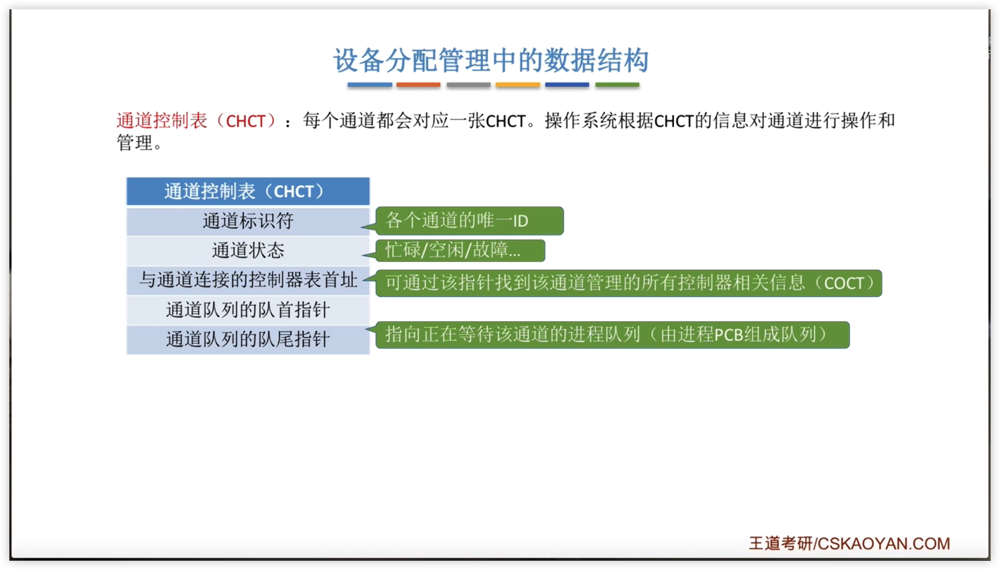

**系统设备表**

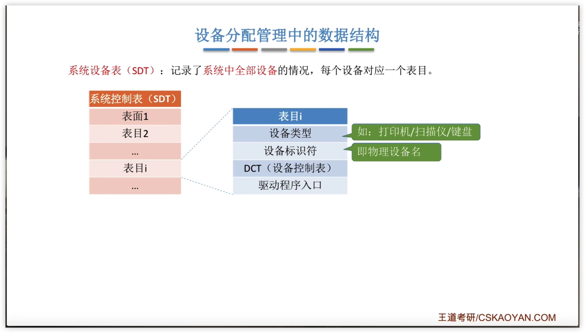

### 设备分配的步骤

1. 根据进程请求的 **物理设备名** 查找SDT（注：物理设备名是进程请求分配设备时提供的参数）
2. 根据SDT找到DCT，若 **设备** 忙碌则将进程PCB挂到 **设备等待队列** 中，不忙碌则将 **设备** 分配给进程
3. 根据DCT找到COCT，若 **控制器** 忙碌则将进程PCB挂到 **控制器等待队列** 中，不忙碌则将 **控制器** 分配给进程
4. 根据COCT找到CHCT，若 **通道** 忙碌则将进程PCB挂到 **通道等待队列** 中，不忙碌则将 **通道** 分配给进程

>[!Caution] 注意
>只有设备、控制器、通道三者都分配成功时，这次设备分配才算成功，之后便可后动 I/O 设备进行数据传送

**缺点**：

1. 用户编程时必须使用“物理设备名”，底层细节对用户不透明，不方便编程
2. 若换了一个物理设备，则程序无法运行
3. 若进程请求的物理设备正在忙碌，则即使系统中还有同类型的设备，进程也必须阻塞等待

### 设备分配步骤的改进方法

**改进方法**：建立逻辑设备名与物理设备名的映射机制，用户编程时只需提供逻辑设备名

1. 根据进程请求的 **逻辑设备名** 查找SDT（**注：用户编程时提供的逻辑设备名其实就是“设备类型”**）
2. 查找SDT，找到用户进程 **指定类型的、并且空闲** 的设备，将其分配给该进程。操作系统 **在逻辑设备表（LUT）中新增一个表项**
3. 根据DCT找到COCT，若控制器忙碌则将进程PCB挂到控制器等待队列中，不忙碌则将控制器分配给进程
4. 根据COCT找到CHCT，若通道忙碌则将进程PCB挂到通道等待队列中，不忙碌则将通道分配给进程

**逻辑设备表（LUT）建立了逻辑设备名与物理设备名之间的映射关系**  
某用户进程第一次使用设备时使用逻辑设备名向操作系统发出请求，操作系统根据用户进程指定的设备类型（逻辑设备名）查找系统设备表，找到一个空闲设备分配给进程，并在LUT中增加相应表项  
**如果之后用户进程再次通过相同的逻辑设备名请求使用设备，则操作系统通过LUT表即可知道用户进程实际要使用的是哪个物理设备了，并且也能知道该设备的驱动程序入口地址**

**逻辑设备表的设置问题**：

*整个系统只有一张LUT*：各用户所用的逻辑设备名不允许重复，适用于单用户操作系统  
*每个用户一张LUT*：不同用户的逻辑设备名可重复，适用于多用户操作系统

## 缓冲区管理

缓冲区是一个存储区域，可以由专门的硬件寄存器组成，也可利用内存作为缓冲区  
使用 **硬件作缓冲区** 的 **成本较高**，**容量也较小**，一般仅用在对速度要求非常高的场合（如存储器管理中所用的联想寄存器，由于对页表的访问频率极高，因此使用速度很快的联想寄存器来存放页表项的副本）
一般情况下，更多的是利用 **内存作为缓冲区**，“设备独立性软件”的缓冲区管理就是要组织管理好这些缓冲区

### 缓冲区的作用

缓和CPU与 I/O 设备之间速度不匹配的矛盾  
减少对CPU的中断频率，放宽对CPU中断相应时间的限制  
解决数据粒度不匹配的问题  
提高CPU与 I/O 设备之间的并行性

### 单缓冲

假设某用户进程请求某种块设备读入若干块的数据。若采用 **单缓冲** 的策略，操作系统会在 **主存中为其分配一个缓冲区**（若题目中没有特别说明，一个缓冲区的大小就是一个块）

>[!Caution] 注意
>当缓冲区数据非空时，不能往缓冲区冲入数据，只能从缓冲区把数据传出；当缓冲区为空时，可以往缓冲区冲入数据，但必须把缓冲区充满以后，才能从缓冲区把数据传出

C：处理器处理用户进程工作区缓冲区内容所花时间  
T：从硬盘到内存缓冲区的时间  
M：从内存缓冲区到用户进程工作区缓冲区的时间

**结论**：采用单缓冲策略，处理一块数据平均耗时 **Max(C,T)+M**

### 双缓冲

假设某用户进程请求某种块设备读入若干块的数据。若采用 **双缓冲** 的策略，操作系统会 **在主存中为其分配两个缓冲区**（若题目中没有特别说明，一个缓冲区的大小就是一个块）

**结论**：采用双缓冲策略，处理一个数据块的平均耗时为 **Max(T,C+M)**

### 循环缓冲

将多个 **大小相等** 的缓冲区链接成一个 **循环队列**

**需要两个指针**：

- *in 指针*：指向下一个可以冲入数据的空缓冲区
- *out 指针*：指向下一个可以取出数据的满缓冲区

### 缓冲池

**缓冲池** 由系统中共用的缓冲区组成。这些缓冲区按使用状况可以分为：空缓冲队列、装满输入数据的缓冲队列（输入队列）、装满输出数据的缓冲队列（输出队列）  
另外，根据一个缓冲区在实际运算中扮演的功能不同，又设置了四种工作缓冲区：用于 **收容输入数据** 的工作缓冲区（hin）、用于 **提取输入数据** 的工作缓冲区（sin）、用于 **收容输出数据** 的工作缓冲区（hout）、用于 **提取输出数据** 的工作缓冲区（sout）

# 磁盘

## 磁盘的结构

### 磁盘、磁道、扇区

磁盘的表面由一些磁性物质组成，可以用这些磁性物质来记录二进制数据

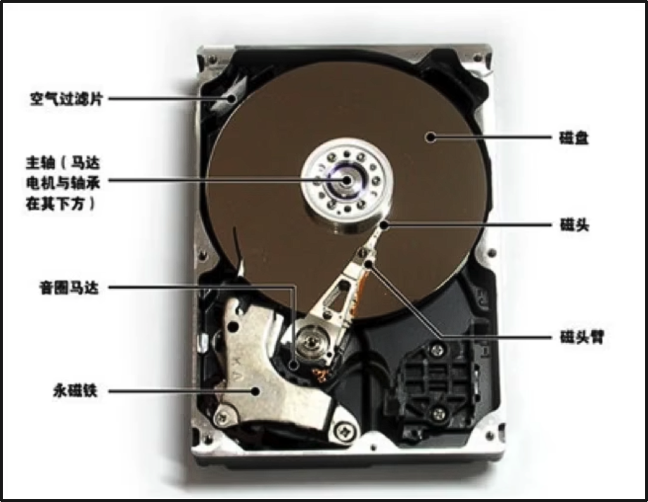

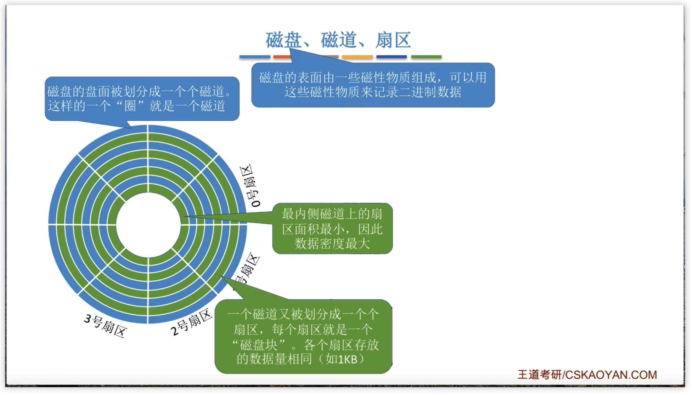

### 从磁盘中读/写数据

需要把 **磁头** 移动到想要读/写的扇区所在的磁道  
磁盘会转起来，让目标扇区从磁头下面划过，才能完成对扇区的读/写操作

### 磁盘的物理地址

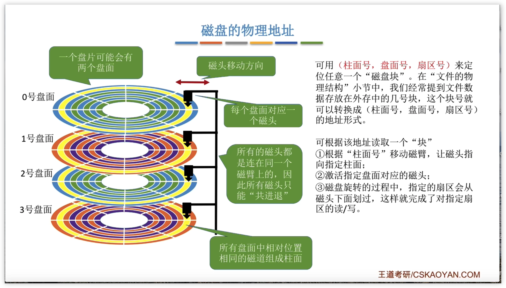

### 磁盘的分类

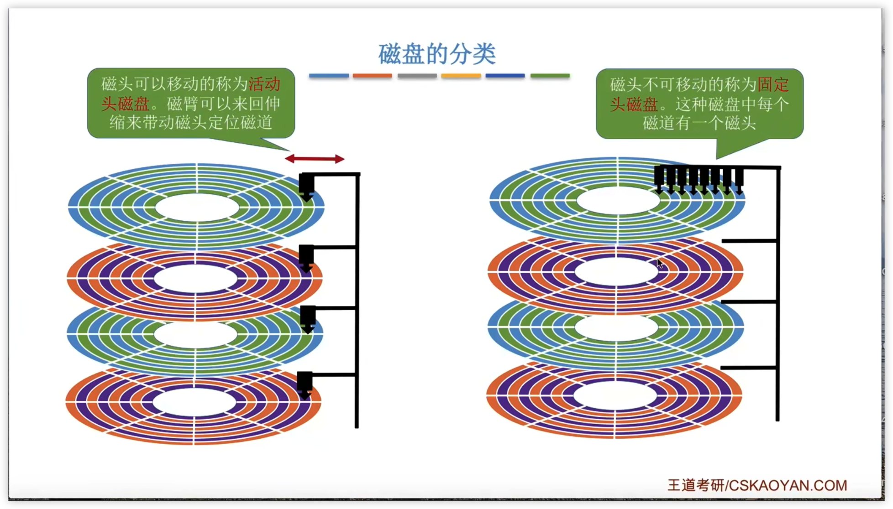

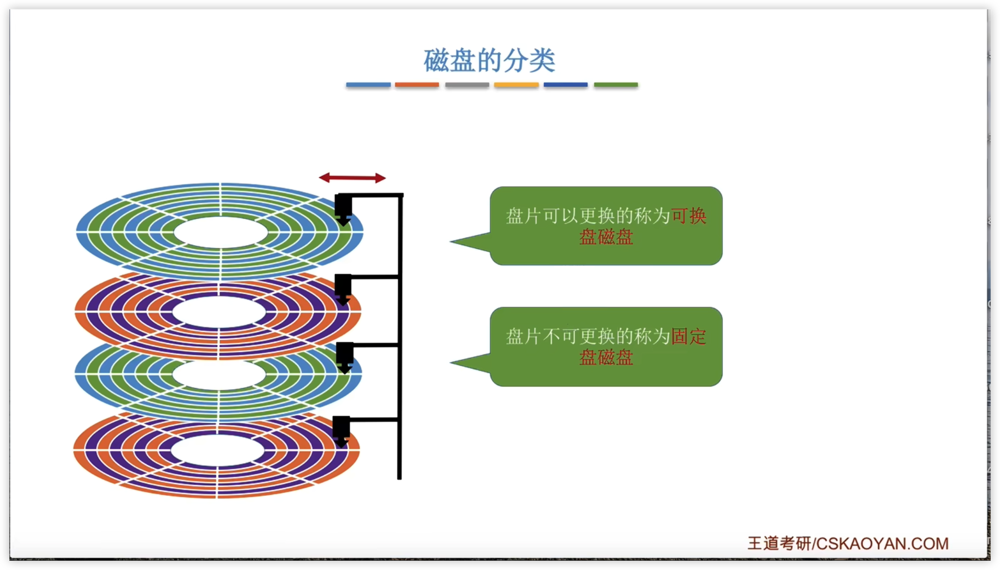

## 磁盘的调度算法

### 一次磁盘读/写操作需要的时间

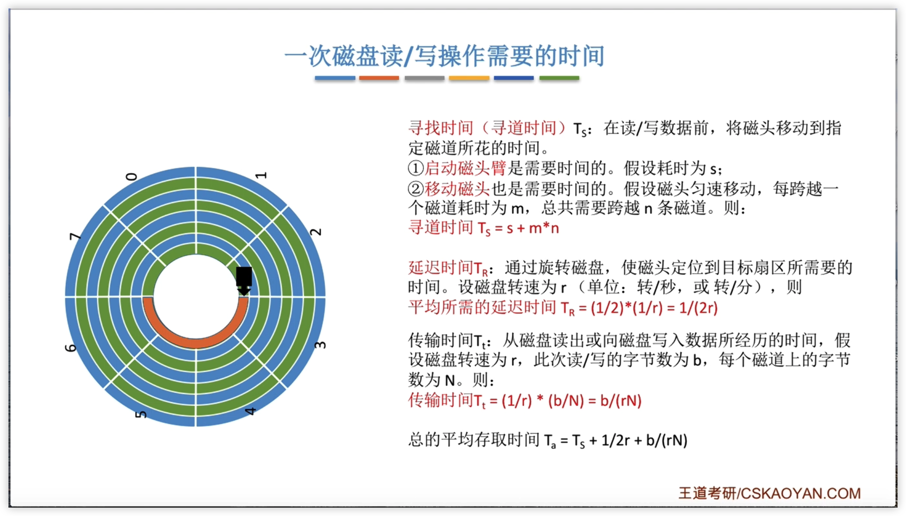

**寻找时间（寻道时间）**：$T_s=s+m*n$  
**延迟时间**：$T_R=\cfrac{1}{2}*\cfrac{1}{r}=\cfrac{1}{2r}$  
**传输时间**：$T_t=\cfrac{1}{r}*\cfrac{b}{N}=\cfrac{b}{rN}$  
**总的平均时间**：$T_a=T_s+\cfrac{1}{2r}+\cfrac{b}{rN}$

### 磁盘调度算法

#### 先来先服务（FCFS）

根据进程请求访问磁盘的先后顺序进行调度

**优点**：公平；如果请求访问的磁道比较集中的话，算法性能还算过的去  
**缺点**：如果有大量进程竞争使用磁盘，请求访问的磁道很分散，则FCFS在性能上很差，寻道时间长

#### 最短寻找时间优先（SSTF）

SSTF 算法会优先处理的磁道是与当前磁头最近的磁道。可以保证每次的寻道时间最短，但是并不能保证总的寻道时间最短。（其实就是贪心算法的思想，只是选择眼前最优，但是总体未必最优）

**优点**：性能较好，平均寻道时间短  
**缺点**：可能产生 **[饥饿](进程管理.md#死锁饥饿死循环的区别)** 现象

#### 扫描算法（SCAN）

SSTF 算法会产生饥饿的原因在于：磁头有可能在一个小区域内来回来去地移动。为了防止这个问题，可以规定，**只有磁头移动到最外侧磁道的时候才能往内移动，移动到最内侧磁道的时候才能往外移动**。这就是 **扫描算法（SCAN）** 的思想。由于磁头移动的方式很像电梯，因此也叫 **电梯算法**

**优点**：性能较好，平均寻道时间较短，不会产生饥饿现象  
**缺点**：

1. 只有到达最边上的磁道时才能改变磁类移动方向，事实上，处理的磁道的那侧没有需要处理的磁道就可以改变方向了
2. SCAN算法对于各个位置磁道的响应频率不平均

#### LOOK调度算法

**扫描算法（SCAN）** 中，只有到达最边上的磁道时才能改变磁头移动方向  
**LOOK 调度算法** 就是为了解决这个问题，**如果在磁头移动方向上已经没有别的请求，就可以立即改变磁头移动方向**（边移动边观察，因此叫 LOOK）

**优点**：比起SCAN算法来，不需要每次都移动到最外侧或最内侧才改变磁头方向，使寻道时间进一步缩短

#### 循环扫描算法（C-SCAN）

SCAN算法对于各个位置磁道的响应频率不平均，而 **C-SCAN 算法** 就是为了解决这个问题。规定只有磁头朝某个特定方向移动时才处理磁道访问请求，而 **返回时直接快速移动至起始端而不处理任何请求**

**优点**：比起SCAN 来，对于各个位置磁道的响应频率很平均  
**缺点**：只有到达最边上的磁道时才能改变磁头移动方向

#### C-LOOK算法

C-SCAN 算法的主要缺点是只有到达最边上的磁道时才能改变磁头移动方向，并且磁头返回时不一定需要返回到最边缘的磁道上。C-LOOK 算法就是为了解决这个问题。如果磁头移动的方向上己经没有磁道访问请求了，就可以立即让磁头返回，并且磁头只需要返回到有磁道访问请求的位置即可

**优点**：比起C-SCAN 算法来，不需要每次都移动到最外侧或最内侧才改变磁头方向，使寻道时间进一步缩短

## 减少磁盘延迟时间的方法

假设要连续读取橙色区域的2、3、4扇区：  
磁头读取一块的内容（也就是一个扇区的内容）后，需要一小段时间处理，而盘片又在不停地旋转  
因此，如果2、3号扇区相邻着排列，则读完2号扇区后无法连续不断地读入3号扇区  
必须等盘片继续旋转，3号扇区再次划过磁头，才能完成扇区读入

**结论**：磁头读入一个扇区数据后需要一小段时间处理，如果逻辑上相邻的扇区在物理上也相邻，则读入几个连续的逻辑扇区，可能需要很长的 **延迟时间**

### 交替编号

若采用交替编号的策略，即让逻辑上相邻的扇区在物理上有一定的间隔，可以使读取连续的逻辑扇区所需要的延迟时间更小

### 错位命名

让相邻盘面的扇区编号"错位"

### 磁盘地址结构的设计

**思考**：为什么？  
磁盘的物理地址是（柱面号，盘面号，扇区号）而不是（盘面号，柱面号，扇区号）

**答**：读取地址连续的磁盘块时，采用（柱面号，盘面号，扇区号）的地址结构可以减少磁头移动消耗的时间

## 磁盘的管理

### 磁盘初始化

1. 进行 **低级格式化**（**物理格式化**），将磁盘的各个磁道 **划分为扇区**。一个扇区通常可分为 头、数据区域（如512B大小）、尾 三个部分组成。管理扇区所需要的各种数据结构一般存放在头、尾两个部分，包括扇区校验码（如奇偶校验、CRC循环冗余校验码等，校验码用于校验扇区中的数据是否发生错误）
2. 将磁盘分区，每个分区由若干柱面组成（即分我们熟悉的C盘、D盘、E盘）
3. 进行 **逻辑格式化**，创建文件系统。包括创建文件系统的根目录、初始化存储空间管理所用的数据结构（如 位示图、空闲分区表）

### 引导块

### 坏块的管理

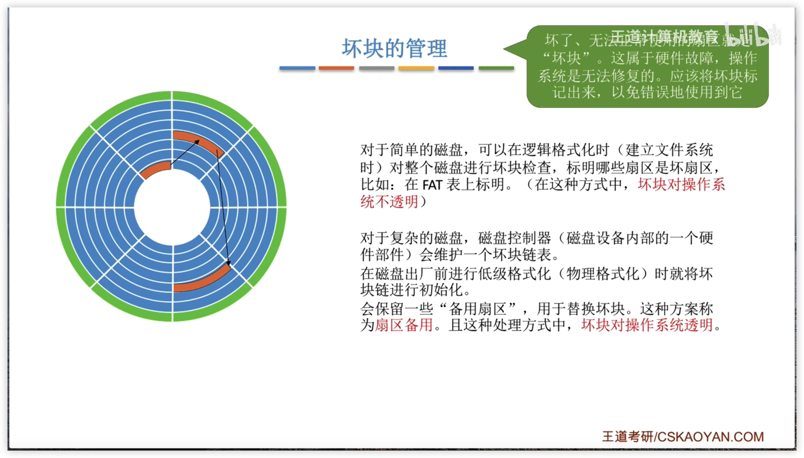

## 固态硬盘SSD

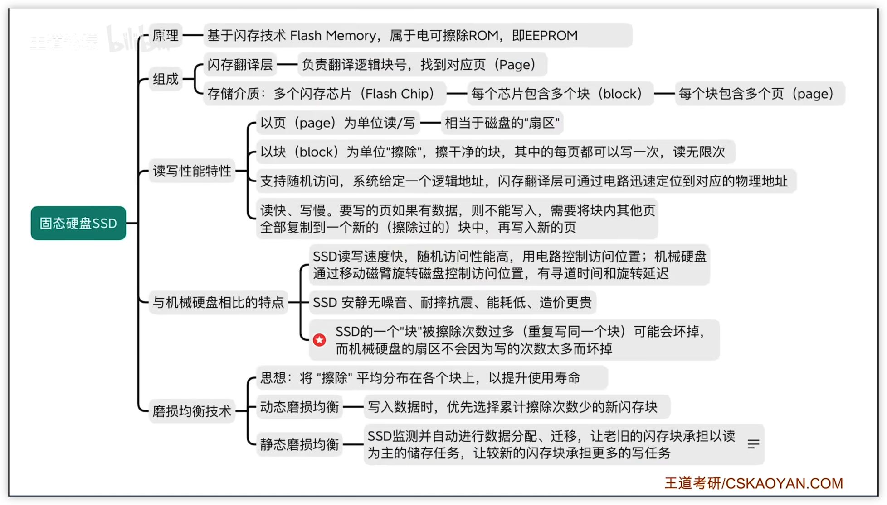