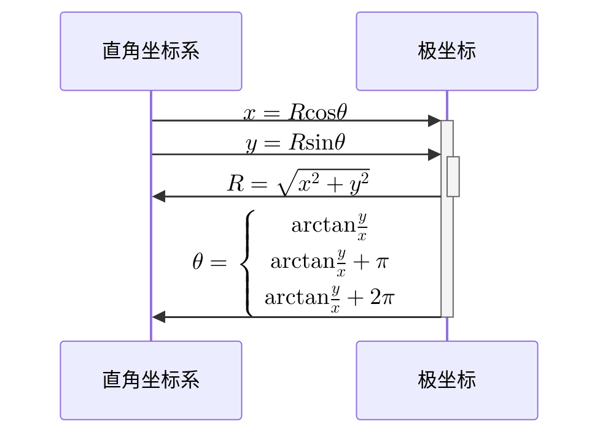

---
tags:
  - 科目/高数
  - 完成
  - 整理
---

# 高中数学基础

## 函数基础知识

### 函数
幂函数
指数函数
对数函数
三角函数
	单位圆
反三角函数
### 反函数
满足单射条件的的函数才有反函数
1.用y表示x
2.把y和x对调
性质：一个函数与反函数之间的曲线是关于y=x对称的
### 三角函数
#### 基本公式
$(\sin^{2}\alpha+\cos^{2}\alpha = 1)；(1+\tan^{2}\alpha=\sec^{2}\alpha)；(1+\cot^{2}\alpha=\csc^{2}\alpha)$
$(\sin(\alpha+\beta)=\sin\alpha\cos\beta+\cos\alpha\sin\beta);\sin(\alpha−\beta)=\sin\alpha\cos\beta−\cos\alpha\sin\beta$
$(\cos(\alpha+\beta)=\cos\alpha\cos\beta-\sin\alpha\sin\beta);\cos(\alpha+\beta)=\cos\alpha\cos\beta−\sin\alpha\sin\beta$
$(\tan(\alpha+\beta)=\cfrac{\tan\alpha+\tan\beta}{1 - \tan\alpha\tan\beta});\tan(\alpha-\beta)=\cfrac{\tan\alpha-\tan\beta}{1+\tan\alpha\tan\beta}​$
#### 倍角公式
$\sin2\alpha=2\sin\alpha\cos\beta$
$\cos2\alpha=\cos^{2}\alpha-\sin^{2}\alpha=1-2\sin^{2}\alpha=2\cos^{2}\alpha-1$
$\cos^{2}\cfrac{\alpha}{2}=\cfrac{1+\cos\alpha}{2};\cos^{2}\alpha=\cfrac{1+\cos{2\alpha}}{2}$
$\sin^{2}\cfrac{\alpha}{2}=\cfrac{1-\cos\alpha}{2};\sin^{2}\alpha=\cfrac{1-\cos{2\alpha}}{2}$
#### 和差化积

#### 积化和差

### 反三角函数
已知三角函数值，反算角度大小

### 指数函数与对数函数
- $y=a^{x},x=\log_{a}y$
- $y=e^x,x=\log_ey=\ln y$
- $y=10^x,x=\log_{10}y=\log y$
##### 对数函数常用公式
- $\log_a(M\cdot N)=\log_a M+\log_a N$
- $\log_a\frac MN=\log_aM-\log_aN$
- $\log_aM^n=n\log_aM$
- $\log_{a^n}M=\cfrac1n\log_aM$
- $\log_ab=\cfrac{\log_cb}{\log_ca}$
- $a^{\log_ab}=b(a>0,a\neq1,b>0)$
- $a=e^{\ln a},a^b=e^{b\ln a}(a>0)$
## 排列组合与二项式定理
### 排列组合
排列数：$A_n^m$
全排列数：$A_n^n=n!$
组合：$C_n^m$
### 二项式定理
$(x+y)^n=C_n^0x^ny^0+C_n^1x^{n-1}y^1+C_n^2x^{n-2}y^2+...C_n^{n-1}x^1y^{n-1}+C_n^nx^0y^n$
## 常用代数公式
### 等差数列求和
$S_n=a_1n+\cfrac{n(n-1)d}2=\cfrac{n(a_1+a_n)}2$
其中$a_1$为数列首项，$d$为公差，$n$为项数
### 等比数列求和
$S_n=\cfrac{a_1(1-q^n)}{1-q}$
其中$a_1$为数列首项，$q$为公比且不等于1，$n$为项数
### 平方和公式
$1+2^2+3^2+4^2+...+n^2=\cfrac{n(n+1)(2n+1)}6$
### $n$次方差公式
$a^n-b^n=(a-b)(a^{n-1}+a^{n-2}b+a^{n-3}b^2+...+ab^{n-2}+b^{n-1}),n\in N^*$
>设$n=4$
>$a^4-b^4=(a-b)(a^3+a^2b+ab^2+b^3)$
>$(a^3+a^2b+ab^2+b^3)=\cfrac{a^4-b^4}{(1-b)}$
>实际上就是一个等比数列求和，公比：$\frac ba$，$n$项求和
### $n$次方和公式
$a^n+b^n=(a+b)(a^{n-1}-a^{n-2}b+a^{n-3}b^2+...-ab^{n-2}+b^{n-1}),n\in(2N^*+1)$
>设$n=5$
>$a^5+b^5=a^5-(-b)^5$
### $n$次方根差
$\sqrt{a}-\sqrt{b}=\cfrac{(\sqrt{a}-\sqrt{b})(\sqrt{a}+\sqrt{b})}{\sqrt{a}+\sqrt{b}}=\cfrac{a-b}{\sqrt{a}+\sqrt{b}}$：分子有理化
## 极坐标
 $R$表示点到原点的距离，$R\in[0,+\infty]$
 $\theta$表示点与原点连线与$x$轴正向之间的夹角，$\theta\in[0,2\pi]$

# 微积分核心思想

## 微积分
>极限：作为微风和积分的基础，重点研究无穷小和无穷大
>微分：将研究的变量、对象进行细分，实现问题的简化
>积分：将微小的元素进行累积，从微观的观察到宏观规律

# 数列与函数极限
## 数列极限的基本定义
### 定义：
设数列$\{X_n\}$，如果存在常数$a$,对任给定的正数$\varepsilon$，总存在正整数$N$，使得当$n > N$时，不等式$|a_n-a|<\varepsilon$都成立，那么称常数$a$是数列$\{X_n\}$的极限，或者说数列$\{X_n\}$收敛于常数$a$，记为：$\displaystyle\lim_{n\to\infty}X_n=a$,或者$X_n\to(n\to\infty)$。
### 性质：
唯一性：如果数列$\{X_n\}$收敛，那么极限唯一
有界性：如果数列$\{X_n\}$收敛，那么它一定有界
数列有界：存在正数$M$，使得$|X_n|<M$
保号性：如果$\displaystyle\lim_{n\to\infty}X_n=a$，且$a>0$，那么存在正整数$N$，当$n>N$，都有$X_n>0$
子列收敛：如果数列$\{X_n\}$收敛到$a$，那么它的任一子数列也收敛到$a$
## 函数极限的基本定义
### 定义：
设函数$f(x)$在点$x_0$的某一去心邻域内有定义，如果存在常数$A$，对于任意给定的正整数$\varepsilon$，总存在正数$\delta$，使得当$x$满足不等式：$|x-x_0|<\delta$时，$|f(x)-A|<\varepsilon$，那么常数$A$就叫做函数$f(x)$当$x\to x_0$时的极限，记作：$\displaystyle\lim_{x\to x_0}f(x)=A$或$f(x)\to A$(当$x\to x_0$)
## 极限运算法则
1. 有界函数与无穷小相乘，仍然是无穷小
2. 如果$\displaystyle\lim f(x)=A$，$\displaystyle\lim g(x)=B$，（注意，$A$和$B$都是常数）那么
- $\displaystyle\lim [f(x)\pm g(x)]=\displaystyle\lim f(x)\pm \displaystyle\lim g(x)=A\pm B$
- $\displaystyle\lim [f(x)\cdot g(x)]=\displaystyle\lim f(x)\cdot \displaystyle\lim g(x)=A\cdot B$
- 若又有$B\ne0$，则$\displaystyle\lim\frac{f(x)}{g(x)}=\frac{\displaystyle\lim f(x)}{\displaystyle\lim g(x)}=\frac{A}{B}$
## 两个特殊极限
### 极限1
$\displaystyle\lim_{x\to0}\frac{\sin x}{x}=1$
#### 夹逼准则
在$x_0$的某去心邻域内，存在$g(x)<f(x)<h(x)$，且满足$\displaystyle\lim_{x\to x_0}g(x)=\underset{x\to x_0}\lim h(x)=a$，那么${f(x)}$的极限存在，且$\underset{x\to x_0}\lim f(x)=a$
### 极限2
$\displaystyle\lim_{x\to+\infty}(1+\frac{1}{x})^x=e=2.71828\dots$
## 无穷小与无穷大
### 高阶、低阶、同阶、等价无穷小的定义：
下面的$\alpha$及$\beta$都是在同一个自变量的变化过程中的无穷小，且$\alpha\ne0$：
1. 如果$\lim\frac{\beta}{\alpha}=0$，那么就说$\beta$是比$\alpha$高阶的无穷小，记作$\beta=\circ(\alpha)$
2. 如果$\lim\frac{\beta}{\alpha}=\infty$，那么就说$\beta$是比$\alpha$低阶的无穷小
3. 如果$\lim\frac{\beta}{\alpha}=c\ne0$，那么就说$\beta$是比$\alpha$同阶无穷小
4. 如果$\lim\frac{\beta}{\alpha}=c\ne0$，$k>0$，那么就说$b\eta$是关于$\alpha$的$k$阶无穷小
5. 如果$\lim\frac{\beta}{\alpha}=1$，那么就说$\beta$与$\alpha$是等价无穷小，记作$\alpha\sim\beta$
---
### 无穷大的变量之间的对比关系
$\ln x\ll x^a\ll x^b\ll c^x\ll d^x\ll x!\ll x^x(x\to \infty,0<a<b,1<c<d)$
## 极限求解思路
### 求解极限三步走
第一步：代入
将自变量极限值代入极限表达式，如果不能得到结果，继续下一步
第二部：分类
判断极限类型属于“$\frac{0}{0}、\frac{\infty}{\infty}、1^\infty、\infty-\infty、0\cdot\infty、\infty^0$”中的哪一种，重点是识别出式中的无穷小和无穷大成分
第三部：化解
根据极限类型，选择分别适用的求解方法，进行化解或者变形
# 函数的连续性
## 定义
### 定义1
设函数$y=f(x)$在点$x_0$的某一邻域内有定义，如果有$\displaystyle\lim_{\Delta{x}\to{0}}\Delta{y}=\displaystyle\lim_{\Delta{x}\to{0}}[f(x_0+\Delta{x})-f(x_0)]=0$，那么就称函数$y=f(x)$在点$x_0$连续
### 定义2
设函数$y=f(x)$在点$x_0$的某一邻域内有定义，如果有$\displaystyle\lim_{x\to{x_0}}f(x)=f(x_0)$，那么就称函数$y=f(x)$在点$x_0$连续
## 性质
### 有界性与最大值最小值定理
在闭区间上连续的函数在该区间上有界且一定能取得它的最大值和最小值
### 零点定理
设函数$f(x)$在闭区间$[a,b]$上连续，且$f(a)$与$f(b)$异号（即$f(a)\cdot f(b)<0$），则在开区间$(a,b)$内至少有一点$\xi$，使$f(\xi)=0$
### 介值定理
设函数$f(x)$在闭区间$[a,b]$上连续，且在这区间的端点取不同的函数值：$f(a)=A,f(b)=B$则对于$A$与$B$之间的任意一个数$C$，在开区间$(a,b)$内至少有一点$\xi$，使得$f(\xi)=C(a<\xi<b)$
# 导数与微分的概念与运算
## 导数基本定义
**导数**（Derivative），也叫导函数值。 又名微商，是**微积分**中的重要基础概念。 当函数$y=f(x)$的 自变量$x$在一点$x_0$上产生一个增量$\Delta x$时，函数输出值的增量$\Delta y=f(x_0+\Delta x)-f(x_0)$与自变量增量$\Delta x$的比值在$\Delta x$趋于0时的 极限$a$如果存在，$a$即为在$x_0$处的**导数**，记作$f’(x_0)$或$\cfrac{{\rm d}f(x_0)}{{\rm d}x}$
## 导数基本运算
### 导数四则运算法则
如果函数$f(x)$与$g(x)$各自存在导数，则有：
1. $[f(x)\pm g(x)]'=f'(x)\pm g'(x)$
2. $[f(x)\cdot g(x)]'=f'(x)\cdot g(x)+f(x)\cdot g'(x)$
3. $[\cfrac{f(x)}{g(x)}]'=\cfrac{f'(x)\cdot g(x)-f(x)\cdot g'(x)}{g^2(x)}(g(x)\ne0)$
### 复合函数求导
如果函数$f(x)$与$g(x)$各自存在导数，则有：$[f(g(x))]'=f'(g(x))\cdot g'(x)$
## 隐函数求导
将$y$看作关于$x$的函数，对等式中的每个元素逐个求导
## 参数方程求
设$y=f(x)$，$\begin{cases}x=x(t)\\y=y(t)\end{cases}$，$x$和$y$是关于$t$的函数，$\cfrac{{\rm d}y}{{\rm d}x}=\cfrac{\cfrac{{\rm d}y}{{\rm d}t}}{\cfrac{{\rm d}x}{{\rm d}t}}$，可以先单独算$y$和$x$对$t$的导数，再相除求的$y'$
## 反函数求导
先将其变成$x$对$y$的函数，对其求导，取倒数
## 高阶函数
### 莱布尼茨公式
如果函数$u(x)$、$v(x)$分别具有$n$阶导数，那么两者乘积的$n$阶导数为如下形式：
$[u(x)\cdot v(x)]^{(n)}=C_n^0u^{(n)}v+C_n^1u^{(n-1)}v^{(1)}+C_n^2u^{(n-2)}v^{(2)}+\cdots+C_n^{n-1}u^{(1)}v^{(n-1)}+C_n^nuv^{(n)}$
# 导数与微分应用
## 基于微分近似计算
### 微分计算法则
1. ${\rm d}y=y'{\rm d}x$
2. ${\rm d}(u\pm v)={\rm d}u\pm{\rm d}v$
3. ${\rm d}(Cu)=C{\rm d}u$I
4. ${\rm d}(uv)=v{\rm d}u+u{\rm d}v$
5. ${\rm d}(\cfrac{u}{v})=\cfrac{v{\rm d}u-u{\rm d}v}{v^2}(v\ne0)$
## 洛必达法则
当满足以下三点条件时：
1. 当$x\to a$时，函数$f(x)$以及$g(x)$都趋于$0$
2. 在点$a$的某去心邻域内，函数$f'(x)$以及$g'(x)$都存在且$g(x)\ne0$
3. $\displaystyle\lim_{x\to a}\frac{f'(x)}{g'(x)}$存在（或为无穷大）
则有：$\displaystyle\lim_{x\to a}\frac{f(x)}{g(x)}=\displaystyle\lim_{x\to a}\frac{f'(x)}{g'(x)}$
## 相关变化率问题
### 相关变化率问题三个步骤
1. 定义描述问题的关键变量
2. 找出变量之间的关系
3. 利用链式法则求得相关变化率，或者将变量进行微分处理
## 函数单调性、凹凸性
### 单调性
设函数$y=f(x)$在$[a,b]$上连续，在$(a,b)$内可导
1. 如果在$(a,b)$内$f'(x)\ge0$，那么函数$y=f(x)$在$[a,b]$上单调增加
2. 如果在$(a,b)$内$f'(x)\le0$，那么函数$y=f(x)$在$[a,b]$上单调减少
### 极大值、极小值
设函数$f(x)$在点$x_0$的某邻域$U(x_0)$内有定义，如果对于去心邻域内的任一$x$，有$f(x)<f(x_0)$(或$f(x)>f(x_0)$)，那么就称$f(x_0)$是函数$f(x)$的一个极大值（或一个极小值）
函数$f(x)$在点$x_0$处可导，且在该点处取得极值，则有$f'(x_0)=0$
#### 判断极值点的方法
1. 一阶导数：在某一点处一阶导数为$0$，且在该点左右区间的导数异号
2. 二阶导数：在某一点处一阶导数为$0$，二阶导为正则取极小值，如果二阶导为负则为极大值
### 凹凸性
设$f(x)$在$[a,b]$上连续，在$(a,b)$内具有一阶和二阶导数，那么
1. 若在$(a,b)$内$f''(x)>0$，则$f(x)$在$[a,b]$上的图形是凹的
2. 若在$(a,b)$内$f''(x)<0$，则$f(x)$在$[a,b]$上的图形是凸的
如果曲线$y=f(x)$在经过点$(x_0,f(x_0))$时，曲线的凹凸性改变了，那么就称点$(x_0),f(x_0)$为这曲线的拐点，<b>拐点是一个坐标</b>
# 泰勒公式
 ## 公式
$f(x)=f(x_0)+f^{(1)}(x_0)(x-x_0)+\cfrac{f^{(2)}(x_0)}{2!}(x-x_0)^2+\cdots+\cfrac{f^{(n)}(x_0)}{n!}(x-x_0)^n+R_n(x)$
### 佩亚诺余项
将不需要的部分替换为前一项的高阶无穷小$o(\text{上一项})$
### 拉格朗日型余项
将不需要的部分替换为$\cfrac{f^{(\text{当前项的导数次数})}(\theta)}{\text{当前项数的阶乘}}x^{(\text{当前项的导数次数})}$
## 常见函数的展开形式
1. $e^x=1+\cfrac{1}{1!}x+\cfrac{1}{2!}x^2+\cfrac{1}{3!}x^3+\cdots$
2. $\sin{x}=x-\cfrac{1}{3!}x^3+\cfrac{1}{5!}x^5+\cdots$
3. $\cos{x}=1-\cfrac{1}{2!}x^2+\cfrac{1}{4!}x^4+\cdots$
4. $\tan{x}=x+\cfrac{1}{x^3}+\cfrac{1}{15}x^5+o(x^5)$
5. $\cfrac{1}{1-x}=1+x+x^2+x^3+x^4+\cdots$
6. $\cfrac{1}{1+x}=1-x+x^2-x^3+x^4+\cdots$
7. $\ln(1+x)=x-\cfrac{x^2}{2}+\cfrac{x^3}{3}-\cfrac{x^4}{4}+\cfrac{x^5}{5}+\cdots$
8. $\cfrac{1}{1+x^2}1-x^2+x^4-x^6+x^8+\cdots$
9. $\arctan(x)=x-\cfrac{x^3}{3}+\cfrac{x^5}{5}-\cfrac{x^7}{7}+\cdots$
# 不定积分
## 积分的本质以及牛顿·莱布尼茨公式
### 牛顿·莱布尼茨公式
$\displaystyle\int_a^bf(x){\rm d}x=F(b)-F(a)$
其中函数$F(x)$与函数$f(x)$之间存在关系：$F'(x)=f(x)$。则称函数$F(x)$为函数$f(x)$的“原函数”。求函数$f(x)$的不定积分就是求函数的原函数$F(x)$
## 不定积分的基本求解方法
### 常用不定积分求解
1. $\int k{\rm d}x=kx+c$
2. $\int x^a{\rm d}x=\cfrac{x^{a+1}}{a+1}+c$
3. $\int \cfrac1x{\rm d}x=\ln{|x|}+c$
4. $\int \cos x{\rm d}x=\sin x+c$
5. $\int \sin x{\rm d}x=-\cos x+c$
6. $\int \cfrac{1}{1+x^2}{\rm d}x=\arctan x+c$
7. $\int \cfrac{1}{\sqrt{1+x^2}}{\rm d}x=\arcsin x+c$
8. $\int \cfrac{1}{\cos^2x}{\rm d}x=\int\sec^2x{\rm d}x=\tan x+c$
9. $\int \cfrac{1}{\sin^2x}{\rm d}x=\int\csc^2x{\rm d}x=-\cot x+c$
10. $\int a^x{\rm d}x=\cfrac{a^x}{\ln a}+c$
11. $\int e^x{\rm d}x=e^x+c$
### 不定积分基本运算法则
$\int[f(x)\pm g(x)]{\rm d}x=\int f(x){\rm d}x+\int g(x){\rm d}x$
$\int kf(x){\rm d}x=k\int f(x){\rm d}x(k\ne0)$
## 凑微分法
### 最基本的微分运算规律
${\rm d}y=y'{\rm d}x$
***找到一部分作为另一部分的导数***
## 第二类换元法
***解决有关根号的问题***
适当的选择变量代换$x=\psi(t)$，换元公式课表达为$\int f(x){\rm d}x=\int f[\psi(t)]\psi'(t){\rm d}t$
## 分布积分
***用于处理多种类型函数组合搭配***
$\int u{\rm d}v=uv-\int v{\rm d}u$
反、对、幂、指、三
在被积函数的里面，谁是上面这些排后面的就把它放到${\rm d}$里面，用分布积分求
## 有理分式积分
**假**分式[^1]：先用长除法将式子变为**真**分式
**真**分式[^2]：将分母拆成互乘的式子，用留数法算未知数
### 特殊情景1
如果分母的次数远高于分子的次数，则可以考虑“倒代换”来解决，令$x=\cfrac{1}{t}$
### 特殊情景2
三角函数的有理分式，$\begin{cases}u=\tan{\cfrac{x}{2}}\\\sin x=\cfrac{2u}{1+u^2}\\\cos x=\cfrac{1-u^2}{1+u^2}\end{cases},{\rm d}x=\cfrac{2}{1+u^2}{\rm d}u$
# 定积分
## 定积分的含义与基本性质

## 定积分运算
### 牛顿·莱布尼茨公式
### 技巧
#### 华莱士公式（点火公式）
$\displaystyle\int_0^{\cfrac{\pi}{2}}\cos^n{\rm d}x=\displaystyle\int_0^{\cfrac{\pi}{2}}\sin^n{\rm d}x=\begin{cases}n奇:\cfrac{n-1}{n}\cdot\cfrac{n-3}{n-2}\cdot\quad\cdots\quad\cdot\cfrac{2}{3}\cdot1\\n偶:\cfrac{n-1}{n}\cdot\cfrac{n-3}{n-2}\cdot\quad\cdots\quad\cdot\cfrac{1}{2}\cdot\cfrac{\pi}{2}\end{cases}$
#### 利用奇偶性
$f(x)$是奇函数：$\displaystyle\int_{-a}^af(x){\rm d}x=0$
$f(x)$是偶函数：$\displaystyle\int_{-a}^af(x){\rm d}x=2\displaystyle\int_{0}^af(x){\rm d}x$
#### 代换
$\displaystyle\int_a^bf(x){\rm d}x=\displaystyle\int_a^bf(a+b-x){\rm d}x$
## 变上限积分
$\begin{align}S(x)&=\displaystyle\int_a^xf(t){\rm d}t\\S(x)&=F(x)-F(x)\\S'(x)&=F'(x)=f(x)\end{align}$
## 广义积分
1. $\displaystyle\int_a^bf(x){\rm d}x\ a,b$固定，存在$c\in[a,b]$，使得$\displaystyle\lim_{x\to c}f(x)=\infty$
	从瑕点[^3]处将式子分成两个部分，单独求
2. $\displaystyle\int_a^\infty f(x){\rm d}x$或$\displaystyle\int_\infty^a f(x){\rm d}x$，$\displaystyle\int_{-\infty}^{+\infty}f(x){\rm d}x$
## 积分应用
### 求旋转体的体积
利用微积分的思维，将旋转体切割为无穷多个圆柱体，相加求和得出整个旋转体的体积
## 利用定积分进行数列求和
### 将一个积分用数列求和表示出来
1. 切成$n$份
2. 将表达式写出来
3. 写成求和表达式
### 将求极限（可以用数列求和表达的）用积分表示出来
1. 提出$\cfrac{1}{n}$
2. 改写为$\sum$
3. $\cfrac{1}{n}\to{\rm d}x,\cfrac{i}{n}\to x$
# 常微分方程
## 微分方程的概念
一般的，凡表示未知函数、未知函数的导数与自变量之间的关系的方程，叫做***微分方程***，有时简称方程。
微分方程中所出现的未知函数的最高阶导数的阶数，叫做***微分方程的阶***
一个简单的微分方程$$y'=x$$则可以得到：$$通解:\qquad y=\cfrac{x^2}{2}+C$$这是微分方程的解。如果改变条件$$\begin{align}y'&=x(x=0,y=1)\\特解：\quad y&=\cfrac{x^2}{2}+1\end{align}$$
## 一阶微分方程
### 分离变量
$$\begin{align*}y'&=2xy\\\cfrac{{\rm d}y}{{\rm d}x}&=2xy\\\int\cfrac{{\rm d}y}{y}&=\int2x{\rm d}x\\\ln{|y|}&=x^2+C\\|y|&=e^{x^2+C}\\|y|&=e^{x^2}\cdot e^C\\y&=\pm e^C\cdot e^{x^2}\\y&=C\cdot e^{x^2}\end{align*}$$
碰到$$\begin{align}y'&=p(x)y\\\text{通解：}\qquad y&=Ce^{\int p(x){\rm d}x}\end{align}$$
### 变换代换
#### 情形1
$$x,y\to\cfrac{y}{x}$$
#### 情形2
$$\begin{align}{\rm d}y=(ax+&by+C){\rm d}x\\&\downarrow\\(ax+by&+C)\Rightarrow u\end{align}$$
### 一阶线性微分方程
$$\begin{align}y'+p(x)y&=q(x)\\\downarrow\quad&\quad\text{通解}\\y=e^{-\int p(x){\rm d}x}&\cdot(\int e^{\int p(x){\rm d}x}\cdot q(x){\rm d}x+C)\end{align}$$
#### 伯努利方程（化为线性微分方程）
$$\begin{align}y'+p(x)y&=q(x)\cdot y^n(n\ne 0,1)\\令\quad u&=y^{1-n}\\y'&=\cfrac{y^n}{1-n}\cdot u'\\&\Downarrow\\u'+(1-n)\cdot p(x)&\cdot u=(1-n)\cdot q(x)\end{align}$$
## 二阶微分方程
### $y''=f(x)$
直接算即可
### $y''=f(x,y')$
令$p=y',y''=p'$$
### $y''=f(y,y')$
令$p=y',y''=\cfrac{{\rm d}p}{{\rm d}x}=\cfrac{{\rm d}p}{{\rm d}y}\cdot\cfrac{{\rm d}y}{{\rm d}x}=\cfrac{{\rm d}p}{{\rm d}x}\cdot p$
## 二阶线性微分方程
### 二阶线性齐次微分方程
设$y=y_1,y=y_2$都是某个微分方程（线性齐次）的解
1. $y=y_1+y_2$也是解
2. $y=Cy_1(C\in R)$也是解
3. $y=ay_1+by_2(a,b\in R)$也是解
### 二阶线性非齐次微分方程
#### 结构
1. 设$y_1$将非齐次微分方程的一个特解，$Y$是与这个微分方程对应的齐次方程的通解，那么非齐次微分方程的通解为$$y=y_1+Y$$
2. 设非齐次微分方程的右端$f(x)$是两个函数之和，即$$y''+p(x)y'+q(x)y=f_1(x)+f_2(x)$$而$y_1(x)$与$y_2(x)$分别是方程$$y''+p(x)y'+q(x)y=f_1(x)$$与$$y''+p(x)y'+q(x)y=f_2(x)$$的特解，则$y_1(x)+y_2(x)$是方程的一个特解
#### 求解
1. 解齐次
2. 求特解$$f(x)=\begin{cases}\text{1}P_n(x)\cdot e^{ax}\quad,P_n(x)是x的n次多项式\\ [P_m(x)\cos\beta x+P_n(x)\sin\beta x]e^{ax}\end{cases}$$
	1. 特解  $$\begin{align}y^*=e^{ax}\cdot(P_n(x))\cdot x^m,&\color{red}(P_n表示n次多项式，常数项是待定系数,m表示a在齐次解中出现次数\\&\color{red}待定系数需要将y^*代入到原式中求出)\end{align}$$
3. 最后的通解：特解和通解相加
## 二阶常系数线性微分方程
### 二阶常系数线性齐次微分方程
$$\begin{align}y''+p\cdot&y'+q\cdot y=0\\&\qquad\downarrow\\r^2+&pr+q=0\end{align}$$
$$r=\begin{cases}r_1\ne r_2\quad r_1,r_2\in R&,y=C_1e^{r_1x}+C_2e^{r_2x}\\r_1=r_2\quad\in R& ,y=(C_1+C_2x)e^{r_1x}\\r_1,r_2=\alpha\pm\beta i&,y=e^{\alpha x}(C_1\cos(\beta x)+C_2\sin(\beta x))\end{cases}$$
### 二阶常系数线性非齐次微分方程
# 空间解析几何与向量代数
## 空间向量
### 点与$x,y,z$轴的距离公式
$$\begin{align}d_x=\sqrt{y^2+z^2}\\d_y=\sqrt{x^2+z^2}\\d_z=\sqrt{x^2+y^2}\end{align}$$
### 两点之间的距离公式
设有两点$A(x_1,y_1,z_1),B(x_2,y_2,z_2)$，则两点距离为$$|AB|=\sqrt{(x_1-x_2)^2+(y_1-y_2)^2+(z_1-z_2)^2}$$
### 向量的线性运算
#### 加减
$$\vec{a}\pm\vec{b}=(a_x\pm b_x)i+(a_y\pm b_y)j+(a_z\pm b_z)k$$
#### 数乘
$$\lambda a=(\lambda a_x,\lambda a_y,\lambda a_z)$$
### 向量的模
设向量$\vec{r}=(x,y,z)$，有$\vec{r}=\overrightarrow{OM}=\overrightarrow{OP}+\overrightarrow{OQ}+\overrightarrow{OR}$，模为$$\begin{align}|r|&=\sqrt{|OP|^2+|OQ|^2+|OR|^2}\\&=\sqrt{x^2+y^2+z^2}\end{align}$$
### 方向角与方向余弦
设坐标上有一点$\vec{v}=(a,b,c)$，方向余弦$$\begin{align}\cos{<\vec{v},\vec{i}>}=\cfrac{a}{\sqrt{a^2+b^2+c^2}}\\\cos{<\vec{v},\vec{j}>}=\cfrac{b}{\sqrt{a^2+b^2+c^2}}\\\cos{<\vec{v},\vec{k}>}=\cfrac{c}{\sqrt{a^2+b^2+c^2}}\end{align}$$
### 数量积与向量积
#### 数量积（向量点乘、内积）投影相关
$$\begin{align}\vec{a}\cdot\vec{b}\quad&,\quad\vec{a}(x_1,y_1,z_1),\vec{b}(x_2,y_2,z_2)\\\vec{a}\cdot\vec{b}&=x_1x_2+y_1y_2+z_1z_2\\&=|\vec{a}|\cdot|\vec{b}|\cdot\cos{<\vec{a},\vec{b}>}\\\cos{<\vec{a},\vec{b}>}&=\cfrac{\vec{a}\cdot\vec{b}}{|\vec{a}|\cdot|\vec{b}|}\end{align}$$
#### 向量积（向量叉乘、外积）面积相关
$$\begin{align}\vec{a}\times\vec{b}\quad&,\quad\vec{a}(x_1,y_1,z_1),\vec{b}(x_2,y_2,z_2)\\\vec{a}\times\vec{b}&=\begin{vmatrix}\vec{i}&\vec{j}&\vec{k}\\x_1&y_1&z_1\\x_2&y_2&z_2\end{vmatrix}\\&=(y_1z_2-y_2z_1,{\color{red}x_2z_1-x_1z_2},x_1y_2-x_2y_1)\end{align}$$
最后算出来的是一个新的向量，该向量垂直于$\vec{a},\vec{b}$，这个向量的模$$|\vec{a}\times\vec{b}|=|\vec{a}|\cdot|\vec{b}|\cdot\sin{<\vec{a},\vec{b}>}$$也是这两个向量所围成的平行四边形的面积
## 空间平面
### 点法式
在平面上有一点$M(x_0,y_0,z_0)$和它的一个法线向量[^4]$n(A,B,C)$，所以有方程$$A(x-x_0)+B(y-y_0)+A(x-x_0)=0$$
### 一般式
$$Ax+By+Cz+D=0$$
### 截距式
$$\cfrac{x}{a}+\cfrac{y}{b}+\cfrac{z}{c}=1$$
### 两平面的夹角
1. 先求两个平面的法向量
2. 求两个法向量的夹角（$|\cos|$保证求的是锐角）
### 点到平面的距离
设平面$Ax+By+Cz+D=0$，点$(x_0,y_0,z_0)$，距离为$$d=\cfrac{|Ax_0+By_0+Cz_0+D|}{\sqrt{A^2+B^2+C^2}}$$
## 空间直线
### 一般式
$$\begin{cases}A_1x+B_1y+C_1z+D_1=0\\A_2x+B_2y+C_2z+D_2=0\end{cases}$$
### 对称式
知道该线上的一点$(x_0,y_0,z_0)$和方向向量$\vec{v}(a,b,c)$$$\cfrac{x-x_0}{a}=\cfrac{y-y_0}{b}=\cfrac{z-z_0}{c}$$
### 参数方程
将对称式$=t$，可以写出$$\begin{cases}x=at+x_0\\y=bt+y_0\\z=ct+z_0\end{cases}$$
### 式子转换
#### 一般式$\to$对称式
获得一点和一个向量
1. 先设$x$某一个数，代入到原式中，求出$y,z$，得到一个点
2. 求的一个向量
	1. 再代入其它值算出第二个点，做差得方向向量
	2. 两个平面的法向量做叉乘，得到方向向量
### 两直线夹角
两个直线的方向向量，求其角度，必需取绝对值，因为夹角只能在$\cfrac{\pi}{2}$内
### 直线与平面的夹角
直线的方向向量为$\vec{v}$，平面的法线向量为$\vec{n}$，两向量的角与要求角为互余$$\sin\theta=\cfrac{|\vec{n}\cdot\vec{v}|}{|\vec{n}|\cdot|\vec{v}|}$$
## 空间曲面

|  名称   |                                                         方程                                                         |
| :---: | :----------------------------------------------------------------------------------------------------------------: |
|  球面   |                                        $(x-x_0)^2+(y-y_0)^2+(z-z_0)^2=R^2$                                         |
|  椭球面  |                      $\cfrac{(x-x_0)^2}{a^2}+\cfrac{(y-y_0)^2}{b^2}+\cfrac{(z-z_0)^2}{c^2}=1$                      |
| 旋转曲面  | $\begin{align}F(x,\sqrt{y^2+z^2})=0\\F(y,\sqrt{x^2+z^2})=0\\F(z,\sqrt{x^2+y^2})=0\\例如：z^2=k^2(x^2+y^2)\end{align}$ |
| 单叶双曲面 |                               $\cfrac{x^2}{a^2}+\cfrac{y^2}{b^2}-\cfrac{z^2}{c^2}=1$                               |
| 双叶双曲面 |                               $\cfrac{x^2}{a^2}-\cfrac{y^2}{b^2}-\cfrac{z^2}{c^2}=1$                               |
| 双曲抛物面 |                                       $\cfrac{x^2}{a^2}-\cfrac{y^2}{b^2}=z$                                        |
| 椭圆抛物面 |                                       $\cfrac{x^2}{a^2}+\cfrac{y^2}{b^2}=z$                                        |
### 旋转曲面
绕着哪个轴旋转，那么哪个轴就不动，将令一个变量变为另外两个的平方和开根的式子
### 空间曲线
#### 一般式 
$$\begin{cases}F(x,y,z)=0\\G(x,y,z)=0\end{cases}$$
<b>得到某个平面的投影，将另一个轴的变量消掉即可</b>
#### 参数式
$$\begin{cases}x=x(t)\\y=y(t)\\z=z(t)\end{cases}$$
# 多元函数微分
## 多元函数的概念
### 定义
设$x,y,z$是三个变量，如变量$z$的取值由变量$x,y$决定，则$x,y$为自变量，$z$为因变量，记为$z=f(x,y)$，定义域为$D_f$，值域为$R_f$
### 极限
必须从任何方向趋于这个点，都有相同的实数值，极限才存在
## 导数
### 偏导数
$$z=f(x,y)\quad,\cfrac{\partial z}{\partial x},\cfrac{\partial z}{\partial y}$$
### 全微分
$${\rm d}z=\cfrac{\partial z}{\partial x}\cdot{\rm d}x+\cfrac{\partial z}{\partial y}\cdot{\rm d}y$$
### 方向导数
$$\cfrac{\partial z}{\partial l}=\cfrac{\partial z}{\partial x}\cdot\cos\theta+\cfrac{\partial z}{\partial y}\cdot\sin\theta$$
### 梯度
$$(\cfrac{\partial z}{\partial x},\cfrac{\partial z}{\partial y})$$
### 复合函数求导
<strong><em>链式法则，画链路，同一个链路相乘，不同链路相加</em></strong>
### 隐函数求导
#### 定理1（导数）
$$\cfrac{{\rm d}y}{{\rm d}x}=-\cfrac{F'x}{F'y}\quad(F'y\ne0)$$
#### 定理2（偏导数）
$$\cfrac{\partial z}{\partial x}=-\cfrac{F'x}{F'z},\cfrac{\partial z}{\partial y}=-\cfrac{F'y}{F'z}\quad(F'y\ne0)$$
#### 定理3（方程组）
<strong><em>克莱姆法则</em></strong>
考虑方程组$\begin{cases}F(x,y,u,v)=0\\G(x,y,u,v)=0\end{cases}$，四个变量中只能有两个自由变化，便导数为$$\begin{align}\cfrac{\partial u}{\partial x}=\cfrac{\begin{vmatrix}F_x&F_v\\G_x&G_v\end{vmatrix}}{\begin{vmatrix}F_u&F_v\\G_u&G_v\end{vmatrix}},&\cfrac{\partial v}{\partial x}=\cfrac{\begin{vmatrix}F_u&F_x\\G_u&G_x\end{vmatrix}}{\begin{vmatrix}F_u&F_v\\G_u&G_v\end{vmatrix}}\\\cfrac{\partial u}{\partial y}=\cfrac{\begin{vmatrix}F_y&F_v\\G_y&G_v\end{vmatrix}}{\begin{vmatrix}F_u&F_v\\G_u&G_v\end{vmatrix}},&\cfrac{\partial v}{\partial y}=\cfrac{\begin{vmatrix}F_u&F_y\\G_u&G_y\end{vmatrix}}{\begin{vmatrix}F_u&F_v\\G_u&G_v\end{vmatrix}}\end{align}$$
### 多元函数极值问题
$Z=f(x,y)$具有偏导数$f_x',f_y'$
1. 令$f_x'=0,f_y'=0$
2. 求得$x,y$有哪些值，组成多少个驻点
3. 算$$f_{xx}''=A,f_{xy}''=B,f_{yy}''=C$$
4. 分情况$$\begin{cases}AC-B^2>0，是极值点，\begin{cases}A>0\quad,极小\\A<0\quad,极大\end{cases}\\AC-B^2<0，不是极值点\\AC-B^2=0，具体问题具体分析\end{cases}$$
5. 把上面求好的列一个表格（方便观察）
6. 求得极值
### 几何应用
#### 空间曲线的切线与法平面
给定空间曲线$$\begin{cases}x=x(t)\\y=y(t)\\z=z(t)\end{cases}$$
1. 先代入$t_0$值求出一个点
2. 求切向量$(x'(t_0),y'(t_0),z'(t_0))$
3. 切线为$\cfrac{x-x_0}{x'(t_0)}=\cfrac{y-y_0}{y'(t_0)}=\cfrac{z-z_0}{z'(t_0)}$
4. 法平面为$x'(t_0)(x-x_0)+y'(t_0)(y-y_0)+z'(t_0)(z-z_0)=0$
#### 空间曲面的法线与切平面
给定一个空间曲面$$F(x,y,z)=0$$
1. 求得空间曲面上的一个点$(x_0,y_0,z_0)$
2. 法向量为$(F'x,F'y,F'z)$
3. 法线为$\cfrac{x-x_0}{F'x}=\cfrac{y-y_0}{F'y}=\cfrac{z-z_0}{F'z}$
4. 切平面为$F'x(x-x_0)+F'y(y-y_0)+F'z(z-z_0)=0$
# 重积分
## 二重积分
1. 先将区域画出
2. 看怎么切好计算，计算$x$和$y$的上下区间
3. 计算
	1. 如果先算$x$的积分，式子就是$\iint f(x,y){\rm d}x{\rm d}y$
	2. 如果先算$x$的积分，式子就是$\iint f(x,y){\rm d}y{\rm d}x$
## 极坐标
1. 被积函数$f(x,y)$换为$f(\rho\cos\theta,\rho\sin\theta)$
2. 面积微元由”<strong>${\rm d}x{\rm d}y$“</strong>为“<strong>$\rho{\rm d}\rho{\rm d}\theta$</strong>”
3. 积分上下限根据$\rho,\theta$确定
## 三重积分
先做俯视图，如做不出一个封闭区间，看另外的式子是否能消掉其它的变量，有$x$或$y$。用带$z$的式子求出$z$的上下限 
## 重积分应用
### 空间曲面面积
$$A=\iint_D\sqrt{1+(\cfrac{\partial z}{\partial x})^2+(\cfrac{\partial z}{\partial y})^2}{\rm d}x{\rm d}y$$
### 直线旋转的体积
$$2\pi\iint_D\cfrac{|Ax+By+C|}{\sqrt{A^2+B^2}}{\rm d}x{\rm d}y$$
### 转动惯量
$$\iint\rho r^2{\rm d}x{\rm d}y$$
# 曲线积分与曲面积分
## 曲线积分
### 第一类曲线积分
原式$$\int_L\rho(x,y){\rm d}s\quad(L曲线表达式，\rho函数是密度函数，{\rm d}s是曲线的一小段)$$
1. 换。将$y$换成$x$的表达式，将${\rm d}s$换成$\sqrt{({\rm d}x)^2+({\rm d}y)^2}=\sqrt{1+(\cfrac{{\rm d}y}{{\rm d}x})^2}{\rm d}x$
2. 计算得结果

### 第二类曲线积分
$$\int_LP{\rm d}x+Q{\rm d}y\quad {\color{red}L是有方向的}，P、Q是两个关于x、y的函数$$
### 格林公式
正向边界：沿着线边界走，$D$区域在左边的(一般一个球的正向边界是逆时针)
#### 定理1(格林公式)
设平面有界闭区域$D$由分段光滑闭曲线$L$围成，函数$P(x,y),Q(x,y)$在$D上具有连续偏导数，则有$$$\iint_D(\cfrac{\partial Q}{\partial x}-\cfrac{\partial P}{\partial y}){\rm d}x{\rm d}y=\oint_LP(x,y){\rm d}x+Q(x,y){\rm d}y$$
$\int_LP{\rm d}x+Q{\rm d}y\quad$如果有$\cfrac{\partial Q}{\partial x}-\cfrac{\partial P}{\partial y}=0$这个曲线积分路径无关
## 曲面积分
### 第一类曲面积分
$$\begin{align}\iint_\Sigma\rho(x,y,z){\rm d}s&\quad\Sigma:代表曲面,{\rm d}s:代表曲面面积\\{\rm d}s=&\sqrt{1+(\cfrac{\partial z}{\partial x})^2+(\cfrac{\partial z}{\partial y})^2}{\rm d}x{\rm d}y\end{align}$$
1. 先找出曲面的投影
2. 将$z$用$z,y$替换
### 第二类曲面积分
$$\iint_\Sigma F_x{\rm d}y{\rm d}x+F_y{\rm d}x{\rm d}z+F_z{\rm d}x{\rm d}y$$
1. 确认曲面在3个坐标平面上的投影
2. 根据曲面指定的方向，确认正负号(根据方向和每个平面的夹角)
3. 转化并计算投影区域上的二重积分
# 无穷级数
## 常数项级数
### 常数项级数的概念及基本性质
#### 等比级数
收敛条件：$|q|<1$
#### 调和级数
例:$\underset{n=1}{\overset{+\infty}\sum}\cfrac{1}{n}=+\infty$
收敛情况：发散
#### $p$级数
$\underset{n=1}{\overset{+\infty}\sum}\cfrac{1}{n^p}$
收敛条件：$\begin{cases}p>1\quad收敛\\p\le1\quad发散\end{cases}$
### 审敛法
#### 正项级数
1. 极限审敛
2. 比值审敛法
	>$\underset{n=1}{\overset{+\infty}\sum}a_n\qquad\underset{n\to+\infty}\lim\cfrac{a_{n+1}}{a_n}=\rho$
	>$\begin{cases}\rho>1\quad,发散\\\rho<1\quad,收敛\\
	>\rho=1\quad,方法失效\end{cases}$
3. 比较审敛法
	1. 放缩形式
		>$\underset{n=1}{\overset{+\infty}\sum}a_n,\underset{n=1}{\overset{+\infty}\sum}b_n\qquad\begin{cases}b_n\ge a_n,\sum b_n收敛\Rightarrow\sum a_n收敛\\b_n\le a_n,\sum b_n发散\Rightarrow\sum a_n发散\end{cases}$
	2. 极限形式
		>$\underset{n=1}{\overset{+\infty}\sum}a_n,如果有\underset{n\to+\infty}\lim\cfrac{a_n}{b_n}=C,C\in(0,+\infty)$
		>$\underset{n=1}{\overset{+\infty}\sum}a_n与\underset{n=1}{\overset{+\infty}\sum}b_n具有相同敛散性$
#### 交错级数
##### 收敛条件:
1. 逐项绝对值递减
2. 绝对值趋于$0$
##### 交错收敛
1. 条件收敛
	>$\underset{n=1}{\overset{+\infty}\sum}|a_n|$发散
2. 绝对收敛
	>$\underset{n=1}{\overset{+\infty}\sum}|a_n|$收敛
## 幂级数
### 幂级数的概念及基本性质
$\underset{n=1}{\overset{+\infty}\sum}a_nx^n$
#### 收敛半径和收敛域
1. 收敛半径$$R=\cfrac{1}{\rho}=\underset{n\to+\infty}\lim|\cfrac{a_n}{a_{n+1}}|$$
	1. 当$\rho=0$时，收敛半径为$R=+\infty$
	2. 当$\rho=+\infty$时，收敛半径为$R=0$
2. 收敛域$$\begin{align}x&=-R\quad&:原式收敛（发散）\Rightarrow闭区间（开区间）\\x&=R\quad&:原式收敛（发散）\Rightarrow闭区间（开区间）\end{align}$$
### 函数的幂级数展开
1. 函数展开为幂级数
	1. 找类似的泰勒级数
	2. 需要换元
2. 给一个函数展开式，求和函数
	1. 找一个与这个级数展开式相似的泰勒级数展开式
	2. 找规律将其求出，<strong><em>注意范围</em></strong>
## 傅里叶级数
## 三角函数的正交性
### 三角函数系
$$\{0,1,\cos{x},\sin{x},\cos{2x},\sin{2x},\cos{3x},\sin{3x},\dots,\cos{nx},\sin{nx},\dots\}$$
### 正交性
$$\begin{align}&\int_{-\pi}^{\pi}\sin{nx}\cos{mx}=0\quad(n,m\in N^+)\\&\int_{-\pi}^{\pi}\sin{nx}\sin{mx}=0\quad(n,m\in N^+,n\ne m)\\&\int_{-\pi}^{\pi}\cos{nx}\cos{mx}=0\quad(n,m\in N^+,n\ne m )\end{align}$$
### 函数展开成傅里叶级数
#### 周期为$2\pi$的函数
设$f(x)$是一个函数周期为$2\pi$的的函数，且能展开成三角级数，即$$\begin{align}f(x)&=\underset{n=0}{\overset{+\infty}\sum}a_n\cos{nx}+\underset{n=0}{\overset{+\infty}\sum}b_n\sin{nx}\\&=a_n+\underset{n=1}{\overset{+\infty}\sum}a_n\cos{nx}+\underset{n=1}{\overset{+\infty}\sum}b_n\sin{nx}\\a_0&=\cfrac{1}{2\pi}\int_{-\pi}^{\pi}f(x){\rm d}x\\a_n&=\cfrac{1}{\pi}\int_{-\pi}^{\pi}f(x)\cos{nx}{\rm d}x\\b_n&=\cfrac{1}{\pi}\int_{-\pi}^{\pi}f(x)\sin{nx}{\rm d}x\end{align}$$
若公式中的积分都存在，则称由这组公式确定的系数$a_0,a_1,b_1,a_2,b_2,\dots$为函数$f(x)$的***傅里叶系数***，将系数代入到原式中的三角级数中，叫做$f(x)$的***傅里叶级数***
#### 周期为$2L$的函数
 设$f(x)$是一个函数周期为$2L$的的函数，且能展开成三角级数，即$$\begin{align}f(x)&=\underset{n=0}{\overset{+\infty}\sum}a_n\cos{\cfrac{n\pi}{L}x}+\underset{n=0}{\overset{+\infty}\sum}b_n\sin{\cfrac{n\pi}{L}x}\\&=a_n+\underset{n=1}{\overset{+\infty}\sum}a_n\cos{\cfrac{n\pi}{L}x}+\underset{n=1}{\overset{+\infty}\sum}b_n\sin{\cfrac{n\pi}{L}x}\\a_0&=\cfrac{1}{2L}\int_{-L}^{L}f(x){\rm d}x\\a_n&=\cfrac{1}{L}\int_{-L}^{L}f(x)\cos{\cfrac{n\pi}{L}x}{\rm d}x\\b_n&=\cfrac{1}{L}\int_{-L}^{L}f(x)\sin{\cfrac{n\pi}{L}x}{\rm d}x\end{align}$$
若公式中的积分都存在，则称由这组公式确定的系数$a_0,a_1,b_1,a_2,b_2,\dots$为函数$f(x)$的***傅里叶系数***，将系数代入到原式中的三角级数中，叫做$f(x)$的***傅里叶级数***
#### 狄利克雷收敛定理
设$f(x)$是以$2\pi$为周期的函数如果满足
1. 在一个周期内连续或只有有限个第一类间断点
2. 在一个周期内至多有有限个极值点

则$f(x)$的傅里叶级数在区间$(-\infty,\infty)$内收敛，且
1. 当$x$是$f(x)$的连续点时，该傅里叶级数收敛于$f(x)$
2. 当$x$是$f(x)$的间断点时，该傅里叶级数收敛于$\cfrac{1}{2}[f(x-1)+f(x+0)]$，其中$f(x-0),f(x+0)$分别是$f(x)$在点$x$处的左、右极限

[^1]: 分子的最高次数$\ge$分母的最高次数
[^2]:分子的最高次数$<$分母的最高次数
[^3]:$f(x)=\infty$的点
[^4]: 一非零向量垂直于一平面